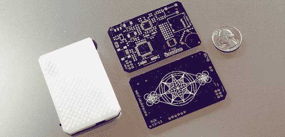

# 颠簸，美丽的 DIY MP3 播放器

> 原文：<https://hackaday.com/2014/05/15/bumpy-the-beautiful-diy-mp3-player/>

[Matt]一直在研究一个小型的 hombrew MP3 播放器，虽然它并不比 iPod Shuffle 有用多少，但有时这就是你所需要的。此外，这是一个漂亮的项目，完全定制，是高分辨率 3D 打印机可以用外壳设计做什么的一个很好的例子。

Bumpy 内部是一个带有 VS1003 MP3 编解码器 IC 的 ATMega32u4。该设备由 1000 毫安时锂电池供电，用户界面非常简洁；单击/滚动滚轮可以改变音量、切换播放和暂停，以及选择下一首或上一首曲目。安装在电路板中心的八个 led 通过外壳发光，用于状态、音量和接口反馈。

到目前为止，颠簸最令人印象深刻的部分是案件。它是在[Matt]的工作场所 Formlabs 用白色 UV 固化树脂打印的。这些照片显示了一种难以在喷射塑料风格的 3D 打印机上复制的表面光洁度，具有纹理，凹凸不平的表面，这激发了该名称。