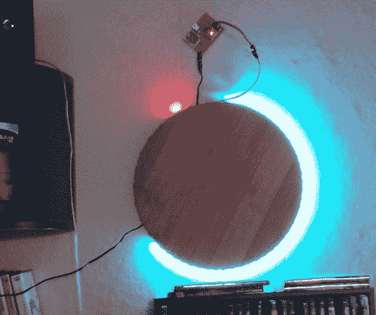

# LED 时钟看起来很酷，可以显示时间

> 原文：<https://hackaday.com/2014/05/16/led-clock-looks-cool-and-tells-time/>

时钟有多种形式，始于公元前 3500 年左右埃及的影钟和日晷。显然，这些只能在太阳出来的时候显示时间。随后出现了水钟，可以在黑暗中追踪时间。水钟基本上是一个底部有一个洞的碗。这个碗被放在一个装满水的容器里。水以恒定的速度进入碗中，碗内的刻度显示了经过的时间。

机械钟紧随其后，还有石英和原子钟。我们现在已经进入了一个计时的新时代，竹制 LED 钟。[Pascal]从德国的给我们带来了这个时髦的新天文钟。

正面由竹制披萨盘制成，为时钟增添了现代简约的活力。一个 1 米长的 LED 带连接到板的周围，包含 60 个单独可分配的 RGB LED。Arduino 和实时时钟负责 LED 的计时和协调。

正如你在照片中看到的，使用了 LED 的两种颜色。单个红色 LED 指示小时。蓝色发光二极管显示分钟。如果你想建造其中的一个，[Pascal]在他的 Instructables 页面上分享了 Arduino 代码。