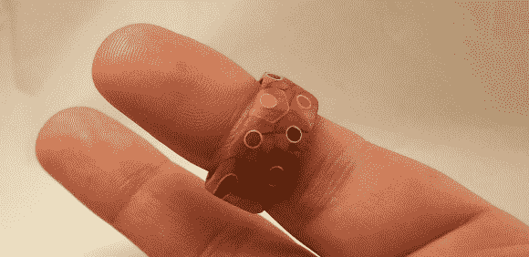

# 一圈彩色铅笔

> 原文：<https://hackaday.com/2014/05/17/a-ring-of-colored-pencils/>

[Peter]用这个[彩色铅笔圈](http://imgur.com/gallery/VFOfu) (imgur 链接)证明了他拥有同等的实力、耐心和毅力。戒指是由几支彩色铅笔的横截面做成的。这个想法似乎很简单。构建过程很简单。不过，一如既往，细节决定成败。

[Peter]从一包便宜的彩色铅笔开始。它们必须是六边形铅笔，因为圆形铅笔不适合这个造型。[Peter]用两枚钉子将铅笔对齐，用中等厚度的氰基丙烯酸酯胶水将它们粘合在一起。氰基丙烯酸酯(又名强力胶)是一种非常坚固但不灵活的粘合剂。我们很好奇不同的粘合剂是否能更好地完成这项任务。

一旦粘好的铅笔干了，[彼得]就钻了一个大约他戒指大小的洞。他用带锯在孔周围切割出一个粗糙的环坯，然后走向木工车床。他用一个卡式卡盘来安装环，卡式卡盘是一块木头，与工件形成过盈配合。问题是，在安装时，夹盘使环破裂。[彼得]能够把戒指粘在一起，并把它放在他的车床上。

点击休息时间，了解有关[Peter ' s ring]的更多信息。

转动之后，[Peter]用车床打磨他的戒指，然后手工打磨剩下的部分。在这个过程中，他的第一枚戒指的一部分脱落了。[Peter]并没有绝望，他做了第二枚戒指，比第一枚要薄得多。虽然第二环也有一些开裂的问题，但他还是完成了。最后一层涂层密封了戒指，确保佩戴者不会在手指上留下彩虹。

你可以通过阅读他在 Reddit 上的帖子来了解更多关于【Peter】身材的信息。

[https://www.youtube.com/embed/xPAK_jR-RKI?version=3&rel=1&showsearch=0&showinfo=1&iv_load_policy=1&fs=1&hl=en-US&autohide=2&wmode=transparent](https://www.youtube.com/embed/xPAK_jR-RKI?version=3&rel=1&showsearch=0&showinfo=1&iv_load_policy=1&fs=1&hl=en-US&autohide=2&wmode=transparent)