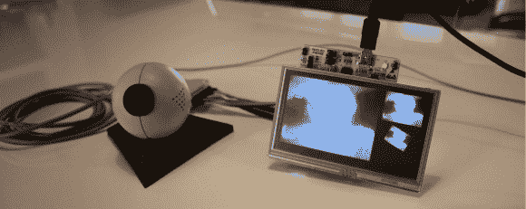
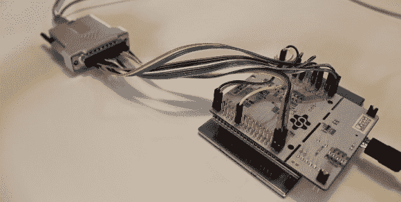

# 黑掉一个旧的并行端口网络摄像头来使用 Gameduino 2

> 原文：<https://hackaday.com/2014/05/18/hacking-an-old-parallel-port-webcam-to-work-with-a-gameduino-2/>

[Andrew]不能错过他在旧货店货架上看到的 20 多年前的基于并行端口的网络摄像头。这是一款 Connectix QuickCam，也是第一款不需要单独的视频输入卡就能与电脑连接的网络摄像头。由于这个功能，网络摄像头非常受欢迎，以至于罗技最终购买了 Connectix 并为自己营销这款相机。

很难找到一台仍然有并行端口的新电脑，但无论如何，使用旧电脑不是[Andrew]的计划。考虑过后，他决定尝试将相机的[图像显示在 Gameduino 2](http://www.theresistornetwork.com/2014/05/ft800-with-streaming-video.html) 上。

硬件列表相当简单。cam 的并行连接器通过几个跳线直接插入 STM32 Nucleo 开发板。Gameduino 2 连接到开发板，USB 转 PS/2 适配器为相机供电。

这显然不是一个即插即用的项目。[Andrew]必须编写自己的摄像头驱动程序。他在网上搜索了一下，找到了一些关于 QuickCam 的很好的文档。这款相机的最大分辨率为 320×240 像素，但在这种情况下，每秒只能拍摄 1 帧的细节。通过将分辨率降低到 80×60，帧速率有所提高。Gameduino 2 上的 FT800 处理器采用 80×60 位图，并将其放大到合理的大小。放大后的图像看起来没有锯齿或像素化，因为 FT800 支持[双线性插值](http://en.wikipedia.org/wiki/Bilinear_interpolation)。

这是一个伟大的工程；它将旧硬件与新硬件连接起来，它包含定制软件、一些电缆黑客和一点盒子外的思考。干得好！

[https://www.youtube.com/embed/z_ik6mA1ZWw?version=3&rel=1&showsearch=0&showinfo=1&iv_load_policy=1&fs=1&hl=en-US&autohide=2&wmode=transparent](https://www.youtube.com/embed/z_ik6mA1ZWw?version=3&rel=1&showsearch=0&showinfo=1&iv_load_policy=1&fs=1&hl=en-US&autohide=2&wmode=transparent)