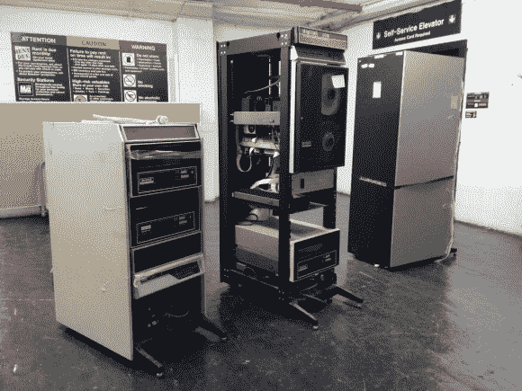

# 纽约电阻器获得 PDP-11/34

> 原文：<https://hackaday.com/2014/05/18/nyc-resistor-gets-a-pdp-1134/>

[Trammel Hudson]和 NYC Resistor 已经得到了 PDP-11/34 形式的旧计算机。 [PDP-11 是由](http://en.wikipedia.org/wiki/PDP-11)[数字设备公司](http://en.wikipedia.org/wiki/Digital_Equipment_Corporation)生产的 16 位微型计算机。从 20 世纪 70 年代一直到 20 世纪 90 年代，PDP-11 的各种型号都有销售。NYC Resistor 的型号有一个可追溯到 1983 年的[标签。](https://www.flickr.com/photos/osr/14019958376/)

PDP 是在布朗克斯的一个旧仓库里找到的。在城市里移动几个架子的设备可不是一件容易的事，但是纽约电阻成员已经做过很多次了，他们已经把它当成了一门科学。

一旦通电，在从 CPU 前面板上键入引导加载程序之前，普通的 PDP 实际上不会做任何事情。幸运的是，这个特殊的 PDP-11 的启动指令[印在 CPU](https://www.flickr.com/photos/osr/14043526294/) 的标签上。NYCR 的机器还包括一个 M9312“引导/单总线终端”板，它允许机器按下按钮启动。

团队连接了机架、终端和驱动器。仔细按照说明，他们实际上得到他们的 PDP 启动！他们的下一步是开始读取机器附带的一些旧磁带。我们都在屏息以待，看看[“数字化猴脑”](https://www.flickr.com/photos/osr/14043543694/in/set-72157644327706146)包含了什么。一旦机器功能齐全，我们希望他们能把它放到网上，并加载 [Hackaday 复古版](http://retro.hackaday.com/)。

<object type="application/x-shockwave-flash" width="500" height="281" data="https://www.flickr.com/apps/video/stewart.swf?v=1535363810" classid="clsid:D27CDB6E-AE6D-11cf-96B8-444553540000"><param name="flashvars" value="intl_lang=en-us&amp;photo_secret=a71dc63624&amp;photo_id=14008897950&amp;flickr_show_info_box=true"><param name="movie" value="https://www.flickr.com/apps/video/stewart.swf?v=1535363810"><param name="bgcolor" value="#000000"><param name="allowFullScreen" value="true"><embed type="application/x-shockwave-flash" src="https://www.flickr.com/apps/video/stewart.swf?v=1535363810" bgcolor="#000000" allowfullscreen="true" flashvars="intl_lang=en-us&amp;photo_secret=a71dc63624&amp;photo_id=14008897950&amp;flickr_show_info_box=true" height="281" width="500"></object>