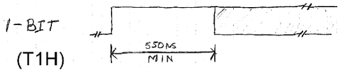

# 使用 1k Arduino RAM 驱动 1000 新像素

> 原文：<https://hackaday.com/2014/05/19/driving-1000-neopixels-with-1k-of-arduino-ram/>

NeoPixels 或 WS2812 RGB LEDs 是当前令人印象深刻的炫目照明项目的显示设备。众所周知，时间要求非常紧， [[Josh]发现这实际上通常是不必要的](http://wp.josh.com/2014/05/13/ws2812-neopixels-are-not-so-finicky-once-you-get-to-know-them/)。一旦你了解了新像素的时序要求，它们并不像看起来那么糟糕。

官方 WS2812 时序规格给出的值对于编写库来驱动这些 RGB LED 像素的任何人来说都是相当有限的，但通过假设数据线上的占空比为 50%并忽略较长的最大时间来简化时序图，会得出一个令人惊讶的结论:新像素信号唯一严格的时序参数是 0 位脉冲的最大宽度。

认识到这一点后，[Josh]编写了一个简单的演示程序，在 Arduino 上使用 1K 的 ram 驱动 1000 多个新像素(11 米长的条带)。诀窍在于简单地将位碰撞延迟一个设定的周期数。不需要钝角组件。

[Josh]驱动几乎无限数量的新像素的方法只有一个问题——在 RAM 数量有限的系统上，不可能构建一个每个新像素都是更大图像中的一个元素的显示器，例如视频显示器。[代码](https://github.com/bigjosh/SimpleNeoPixelDemo)通过算法将值写入新像素条，所以如果你不能用 for 循环构建你的动画，你就不走运了。不过，驱动这么多新像素是一个偏头痛触发器，我们不得不承认[Josh]用 1K 的 RAM 做到了这一点。

查看下面[Josh]的 extreme NeoPixel 条带的视频。

[https://www.youtube.com/embed/I-lR19_kigs?version=3&rel=1&showsearch=0&showinfo=1&iv_load_policy=1&fs=1&hl=en-US&autohide=2&wmode=transparent](https://www.youtube.com/embed/I-lR19_kigs?version=3&rel=1&showsearch=0&showinfo=1&iv_load_policy=1&fs=1&hl=en-US&autohide=2&wmode=transparent)