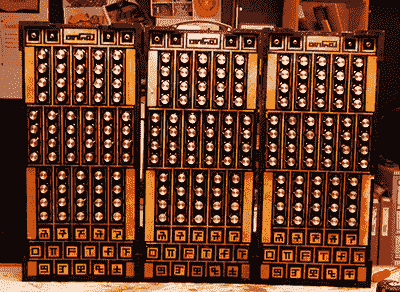

# 真正的福布斯纳什风琴

> 原文：<https://hackaday.com/2014/05/20/the-solafide-forbes-nash-organ/>

几年前，[查德]想造一个乐器。请注意，不是任何一种乐器，而是一种只有音调的乐器。现代西方音乐将 12 个半音映射到每个八度的对数音阶上，而 just temperament 使用比率或分数来表示音阶上的音符。对于正式的学术音乐，这是很奇怪的，尤其是如果你正在为这种气质建立一个模拟合成器。在一篇引人注目的三部曲(第一部、[第二部](http://chadcs.github.io/4.html)和[第三部](http://chadcs.github.io/5.html))中，[查德]回顾了这种极其奇怪的乐器的创作。

这个想法是让这个合成器为刚刚被吟诵的音阶上的每一个音调产生正弦波。[Chad]最初的实验使他走上了使用弦和磁性拾音器来产生这些正弦波的道路。这些想法最初被放弃了，因为要在几十个不同的自制电路板上产生正弦波，每个电路板对应一个音调。

这些按键是一个非常有趣的设计，其工作原理是 LED 发出的光照射到光电探测器上，被激光切割机上弹簧按键上的快门阻挡。上面看到的键上的符号实际上是有意义的；每一个都描述了琴键演奏的音程比率，用一些不太清楚的模式编码。

听起来像什么？下面有三个视频，但是因为这个合成器没有调到你习惯的音量，它听起来不像你以前听过的任何东西。

[https://www.youtube.com/embed/aSb3N9_Ol1w?version=3&rel=1&showsearch=0&showinfo=1&iv_load_policy=1&fs=1&hl=en-US&autohide=2&wmode=transparent](https://www.youtube.com/embed/aSb3N9_Ol1w?version=3&rel=1&showsearch=0&showinfo=1&iv_load_policy=1&fs=1&hl=en-US&autohide=2&wmode=transparent)

[https://www.youtube.com/embed/y8DFuD1wBUs?version=3&rel=1&showsearch=0&showinfo=1&iv_load_policy=1&fs=1&hl=en-US&autohide=2&wmode=transparent](https://www.youtube.com/embed/y8DFuD1wBUs?version=3&rel=1&showsearch=0&showinfo=1&iv_load_policy=1&fs=1&hl=en-US&autohide=2&wmode=transparent)

[https://www.youtube.com/embed/X7TCSNEq1rg?version=3&rel=1&showsearch=0&showinfo=1&iv_load_policy=1&fs=1&hl=en-US&autohide=2&wmode=transparent](https://www.youtube.com/embed/X7TCSNEq1rg?version=3&rel=1&showsearch=0&showinfo=1&iv_load_policy=1&fs=1&hl=en-US&autohide=2&wmode=transparent)