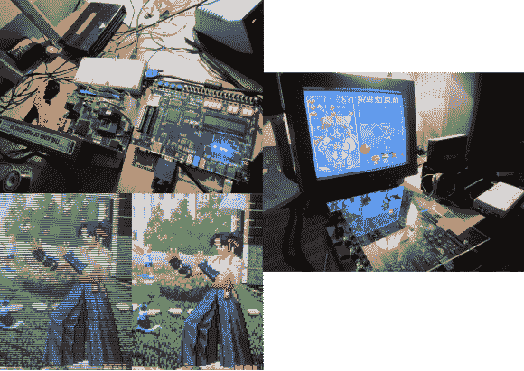

# 近地轨道线路增加了一倍

> 原文：<https://hackaday.com/2014/05/20/neo-geo-gets-line-doubled/>

我们喜欢旧的视频游戏，但我们讨厌模拟隔行扫描视频在我们新的液晶显示器上的样子。[迈克尔]也有同样的感觉，所以他用 VHDL 语言创造了 [NeoVGA，](http://mikejmoffitt.com/wp/?p=270)一个近地轨道倍增器。Neo Geo，像许多经典控制台一样，[没有使用模拟电视的全分辨率](https://wiki.neogeodev.org/index.php?title=Display_timing)。在 [NTSC](http://en.wikipedia.org/wiki/NTSC) 模式下，它以 320×224 像素运行。PAL 用户获得了 320×256 像素的额外 32 个垂直像素。系统以大约 15kHz 的水平同步和大约 60Hz 的垂直同步运行。

这不完全是 VGA 兼容信号，因此它将被归入复合或支持 S-Video 的显示器。信号在 CRT 上看起来很好，但在 LCD 上，它们往往看起来很差。现代 LCD 本身不能处理隔行和/或低分辨率输入信号。电视控制器执行缓冲、插值和转换输入信号的魔法，以与 LCD 面板兼容。正如[Michael]解释的那样，这些算法中的大多数都是针对有大量运动的电视视频信号而优化的。它们在静态高对比度图像(如格斗游戏的背景)上表现不佳。电视控制器也会增加信号链的延迟。看电影时没什么大问题，但当你试图打出三连击时，问题就大了。

点击休息时间，了解更多关于[迈克尔]创作的内容。

市面上有商业解决方案，如 XRGB-3，尽管它们价格昂贵且难以获得。[迈克尔的]解决方案是一个经典的:线加倍。当每一行从源时钟输入时，它被输出两次。这将水平扫描速率提高了一倍，达到 30kHz，与 VGA 兼容。由于视频输出与输入同步，因此几乎没有或根本没有由行倍增过程产生的延迟。

该电路最初是在一个借来的 Altera DE2 板上实现的，尽管[Michael]最终将东西转到了 Xilinx Virtex 2 Pro devboard 上。他仍在解决一些稳定性问题，但我们对进展感到兴奋。

[https://www.youtube.com/embed/nEA6anvHBEA?version=3&rel=1&showsearch=0&showinfo=1&iv_load_policy=1&fs=1&hl=en-US&autohide=2&wmode=transparent](https://www.youtube.com/embed/nEA6anvHBEA?version=3&rel=1&showsearch=0&showinfo=1&iv_load_policy=1&fs=1&hl=en-US&autohide=2&wmode=transparent)