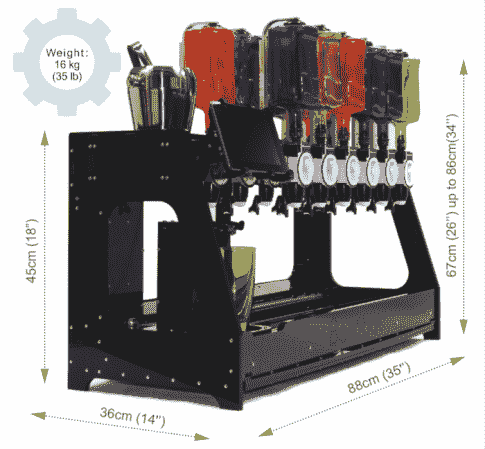

# Barobot 提供鸡尾酒，同时以正确的方式使用开放式设计

> 原文：<https://hackaday.com/2014/05/20/barobot-serves-cocktails-while-using-open-design-the-right-way/>

哦，有一天我们可以停止在维基百科上反复查找我们最喜欢的饮料配方。这些可能就在眼前，您可以选择单击交付或在车间辛苦工作进行临时构建。这是因为 [Barobot](http://barobot.com/) 既满足了消费者市场，也满足了我们对开放硬件优点的渴望。他们正在运行 Kickstarter，但令我们高兴的是，[软件和机械设计文件已经发布](https://code.google.com/p/barobot/)。在你深入研究设计文件之前，先好好看看[装配手册](http://barobot.com/assets/manuals/Barobot_assembly_guide_v03.pdf) (PDF)中的组成部分——那可是一大堆零件！——在[技术内容页面](http://barobot.com/support/tech-stuff/)上也有一点。

这让我们想起了今年早些时候看到的饮料。这一次是伴随着步进电机的高音呜呜声。休息之后，我们在宣传片中没有听到 Barobot 的环境噪音。但这种设计真正闪耀的地方是一个旋转的茶叶罐，允许在类似的足迹双排瓶子。我们想知道的一件事是清洁程序。如果有人知道像这样的清洁需要什么，请在评论中告诉我们。

[https://www.kickstarter.com/projects/barobot/barobot-a-cocktail-mixing-robot/widget/video.html](https://www.kickstarter.com/projects/barobot/barobot-a-cocktail-mixing-robot/widget/video.html) If you were wondering... [that favorite drink recipe](http://en.wikipedia.org/wiki/Margarita). [via [TechCrunch](http://techcrunch.com/2014/05/20/barobot/)]

如果你想知道… [最喜欢的饮料配方](http://en.wikipedia.org/wiki/Margarita)。

[via [TechCrunch](http://techcrunch.com/2014/05/20/barobot/)