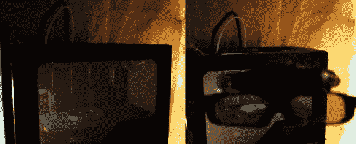

# CastAR 和 3D 打印机的全息打印预览！

> 原文：<https://hackaday.com/2014/05/23/castar-and-holographic-print-preview-for-3d-printers/>

谷歌眼镜这个，Oculus rift 那个，CastAR……随着所有这些新的视觉设备的出现，增强现实的世界正在迅速成为现实！

这是一个非常酷的概念【Ryan Smith】为 3D 打印提出的。利用[Jeri ells worth]的 CastAR，[Ryan Smith]创造了一个非常酷的技术幻觉，在他的 Makerbot 上演示视觉原型。他用激光切割机在 Makerbot 的前塑料面板上打孔，这允许半透明的覆盖层，当你使用 CastAR 的投影仪时，它会给你一种全息视觉效果。

眼镜跟踪参考对象(在这种情况下是齿轮)，然后在现有零件的顶部以动画形式投影接口齿轮。[Ryan]认为这是艺术家和制造商 3D 打印的下一步，因为它可以帮助你对你的零件进行 3D 预览，例如，如果你不完全确定你希望它以什么比例打印，你可以实际上把一个配对的物体或你的手放在屏幕后面，直观地看到界面！

[https://www.youtube.com/embed/cNIFnbaIJqk?version=3&rel=1&showsearch=0&showinfo=1&iv_load_policy=1&fs=1&hl=en-US&autohide=2&wmode=transparent](https://www.youtube.com/embed/cNIFnbaIJqk?version=3&rel=1&showsearch=0&showinfo=1&iv_load_policy=1&fs=1&hl=en-US&autohide=2&wmode=transparent)

【感谢 Spacedog！]