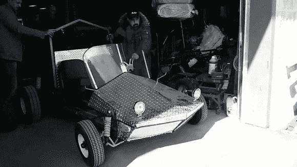
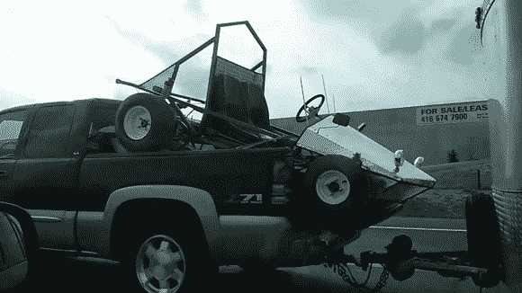

# 介绍通量车-一个严重的电动沙滩车转换

> 原文：<https://hackaday.com/2014/05/25/introducing-the-flux-buggy-a-serious-electric-dune-buggy-conversion/>

信不信由你，Hack a Day 的作者也有他们自己的项目，我们不只是写你的！我刚开始一个新项目，我想听听你的建议！我和几个朋友正在把定制的沙滩车改装成电动的。

该项目将在 Hackaday.io 上记录，每周更新我们的进展。如果你一直在研究项目，你可能已经注意到我几年前的[电动汽车转换](http://hackaday.io/project/21-Electric-Car-Conversion)。在我获得工程学位的第一年，我和我的朋友用电动叉车的内脏将一辆 1993 年的本田德尔索尔改装成电动的。

我们用学校捐赠给我们的旧电池让它以超过 100 公里/小时的速度行驶。不幸的是，有太多的繁文缛节和官僚作风让我们无法合法上路。而且我们是穷大学生，买不起新电池，也买不起保险公司想让它上路的那一大笔钱。这个项目搁置了几年后就废弃了。

快进到今天，我们都毕业了，都在从事我们“轻松”的工程工作，我们人生中第一次有了一些可支配的收入。我们需要一个新项目。

介绍通量车。我们花了 1500 美元在基吉吉找到了这辆沙滩车/卡丁车。它实际上是为卖它的人定制的，我们对它的质量印象深刻。整个东西是由 1-1/4″钢管，所有的轴承和支点有油脂配件，有铝踏板壁板，和一些优质刹车！我们很难以这个价格买到零件！

它最初配备了一台 13 马力的本田发动机，可以让它以大约 50 公里/小时的速度行驶——虽然加速度很低，因为它是直接驱动的——没有变速器。我们以 300 美元的价格卖掉了引擎，然后把它带回家…放在一辆卡车的顶部！

这是大约一个月前。从那以后，我们买了半打船用 12V 铅酸电池，开始加工变速箱，并在童车侧面安装电池。我一直在拍摄视频，并将尝试每周发布新的视频。看一看，让我知道你的想法！

[https://www.youtube.com/embed/R3W9oFghz3M?version=3&rel=1&showsearch=0&showinfo=1&iv_load_policy=1&fs=1&hl=en-US&autohide=2&wmode=transparent](https://www.youtube.com/embed/R3W9oFghz3M?version=3&rel=1&showsearch=0&showinfo=1&iv_load_policy=1&fs=1&hl=en-US&autohide=2&wmode=transparent)

[https://www.youtube.com/embed/6KtZ6G6hNg4?version=3&rel=1&showsearch=0&showinfo=1&iv_load_policy=1&fs=1&hl=en-US&autohide=2&wmode=transparent](https://www.youtube.com/embed/6KtZ6G6hNg4?version=3&rel=1&showsearch=0&showinfo=1&iv_load_policy=1&fs=1&hl=en-US&autohide=2&wmode=transparent)

现在——这就是我们需要你帮助的地方！建议你想看的东西——我们不在乎它们有多疯狂！

*   我们需要一个更好的名字。我们想给它起个傻名字，比如一个人的名字——比如斯文。但我愿意这么做的唯一方法是 SVEN 实际上是车辆的巧妙缩写。
*   升级:
    我们计划为这个坏小子准备两套轮胎。越野用的 17 英寸多节卡车轮胎(以那样的比例看起来会像一辆巨大的遥控汽车)，赛道用的光滑的普通轮胎。现在它将有两种传动比。高速度和高扭矩。我们预计高速版大约 111 公里/小时(我们需要安全带)，低速版大约只有 60 公里/小时——但它会走吗？你想看什么？彩弹枪炮塔？LED 投光灯？音响系统？自动驾驶？飞行模式？涡轮按钮？让我们知道！
*   视频:
    说实话——它们无聊吗？我正在尽可能地减少内容，以保持娱乐性和趣味性。你想看更多的什么？你不想看到什么？

我想现在就这样吧。我们希望你喜欢它！不要忘记在黑客日项目中关注它——下一次它登上头版可能要等到我们对它进行测试之后！