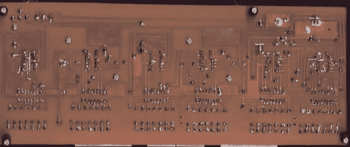

# 数字钟的设计与制作

> 原文：<https://hackaday.com/2014/05/26/the-design-and-fabrication-of-a-digital-clock/>

这个时钟是凯文做的第一件东西，远在 Arduinofication 之前，远在开放硬件社区爆炸之前，也远在廉价的定制印刷电路板出现之前。这是一个优雅的设计，有六个七段显示器，时基来自线路频率，完全由 74 系列逻辑芯片控制。只有一个问题:它有点糟糕。有时，噪音会成为一个因素，时间会显示为 97:30。这个项目被扔到了壁橱后面，完成了一些修改，13 年后，[凯文]想修理他的第一个时钟。

重新设计使用相同的 1Hz 时基来控制电路，但现在时基由一个带 ATtiny85 的 DS3231 RTC 控制。桥式整流器被抛弃了，取而代之的是更简单的 7805 调节器，一个新的电路板被设计出来并送到了 OSHPark。哦，时代变了。

有了新的电路，[Kevin] [决定建造一个新的箱子](http://kevinrye.net/files/upgrading_my_old_7490_clock_p2.php)。漂亮的哈蒙德式外壳被最新最棒的 DIY 外壳材料——激光切割亚克力材料所取代。以前，[Kevin]会在从线路频率获得的 1Hz 时基上放置一个跳线来设置时钟，这使得在午夜插入时钟成为一个简单得多的解决方案。现在，这个钟有按钮来设置小时和分钟。有了很大的改进，但仍然令人惊讶地看到 DIY 电子产品在十年多一点的时间里走了多远。