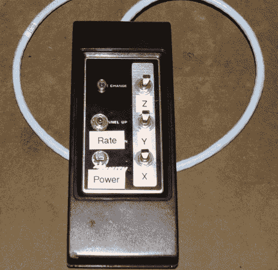

# 古老的电视遥控器变成了数控挂件

> 原文：<https://hackaday.com/2014/05/26/ancient-tv-remote-becomes-a-cnc-pendant/>

他的数控机床需要一个控制悬架式操纵台，[鲍伯·戴维斯]走到废物箱前，开始寻找零件。他想出的东西很酷——那是一个相当旧的 Zenith 电视遥控器提供的外壳！

当建造一台自制的数控机床时，许多人忽略了一个最方便的部件——控制盒。在商用机器上，它们可能会变得相当昂贵——在自制机器上，大多数人只是使用计算机来控制它，但如果你以前使用过挂件，你就会知道它们对于手动操作来说是多么方便！

那么你应该怎么做呢？好吧，你可以为你的数控机床制作第二个专用键盘[(可以说算不上什么黑客，但相当聪明)——或者你可以像【鲍勃】那样从头开始制作一个挂件。这很简单。他正在使用一个 555 定时器，几个瞬时拨动开关，一个 LED，并计划在未来增加一个电位计来控制速度。这一切都装在旧的电视遥控器里，看起来效果不错——看看下面的视频:](http://hackaday.com/2014/04/11/a-brilliant-and-elegant-cnc-pendant/)

[https://www.youtube.com/embed/nbSun9bJMPo?version=3&rel=1&showsearch=0&showinfo=1&iv_load_policy=1&fs=1&hl=en-US&autohide=2&wmode=transparent](https://www.youtube.com/embed/nbSun9bJMPo?version=3&rel=1&showsearch=0&showinfo=1&iv_load_policy=1&fs=1&hl=en-US&autohide=2&wmode=transparent)

[via [被黑的小工具](http://hackedgadgets.com/2014/05/22/diy-cnc-pendant/)