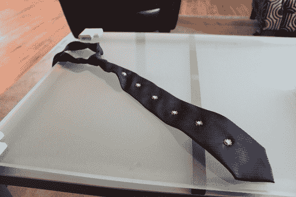

# 互联网控制的 led 领带点亮派对

> 原文：<https://hackaday.com/2014/05/26/internet-controlled-led-necktie-lights-up-the-party/>

可穿戴设备在某些圈子里非常流行——为了寻找自己的项目，[Hector Urtubia]决定尝试一下这种六色领带。

过去，如果不花费所有的时间和精力让互联网连接成为可能，制造一个连接互联网的设备是非常困难的——直到 Pinoccio T1 的出现。这是一个微型 Arduino 兼容板，内置无线互联网连接。它甚至配有可充电电池。如果你有 Arduino 编程经验，这个小东西很容易运行。

tie 本身使用了六个新像素，它们是可链接、可寻址和电流调节的 RGB LEDs，这意味着整个 led 链只需要 Pinoccio 上的一个数字引脚！[Hector]甚至已经编写了一个库,它将扩展 Pinoccio 的脚本环境，以便像素可以直接从 web 或 API 进行交互。

为了演示这款领带，他决定将它挂在他的 MIDI 键盘上——享受:

[https://www.youtube.com/embed/r3Dq-jRaNEg?version=3&rel=1&showsearch=0&showinfo=1&iv_load_policy=1&fs=1&hl=en-US&autohide=2&wmode=transparent](https://www.youtube.com/embed/r3Dq-jRaNEg?version=3&rel=1&showsearch=0&showinfo=1&iv_load_policy=1&fs=1&hl=en-US&autohide=2&wmode=transparent)

对于更多的可穿戴设备，一件 LED 礼服当然会给人留下深刻印象！