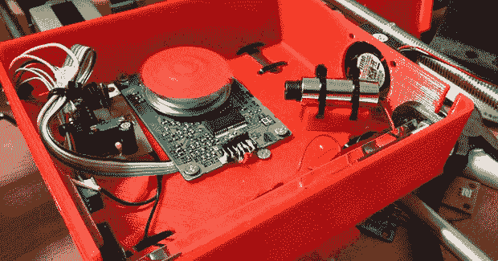

# OpenExposer，DIY SLA 打印机

> 原文：<https://hackaday.com/2014/05/28/openexposer-the-diy-sla-printer/>

精确应用紫外线是一件令人惊奇的事情。你可以曝光 PCB，打印 3D 物体，甚至制作激光表演。在项目现场，[Mario]正在建造一台机器来做所有这些事情。它被称为 OpenExposer ，即使它没有赢得 Hackaday 奖，它也是一个很好的例子，表明你可以利用一些回收的电子产品和 3D 打印机走多远。

OpenExposer 的基本计划是一台 3D 打印机，在床上切出一个小切口，以及一个在 Z 轴上移动的构建平台。床上有一个小型紫外激光器和一个从枯树激光打印机上撕下来的多面镜。通过在 Y 方向移动床，[马里奥]在 XY 平面上的任何地方发射他的激光。把一个装满 UV 固化树脂的罐子放在床上，他就有了 SLA 打印机。在床上放一个安装支架，双面 PCB 就不在话下了。

该框架由 3D 打印零件和标准 RepRap 杆制成，唯一难以获得的组件是多边形镜子。这些可以从偷来的激光打印机上获得，但中国可能会有一些公司批量出售它们。朋友们，廉价 SLA 打印机的时代正在到来。下面视频， [github 这里](http://github.com/mariolukas/openexposer)。

[https://www.youtube.com/embed/OfJ8oP9uU_w?version=3&rel=1&showsearch=0&showinfo=1&iv_load_policy=1&fs=1&hl=en-US&autohide=2&wmode=transparent](https://www.youtube.com/embed/OfJ8oP9uU_w?version=3&rel=1&showsearch=0&showinfo=1&iv_load_policy=1&fs=1&hl=en-US&autohide=2&wmode=transparent)