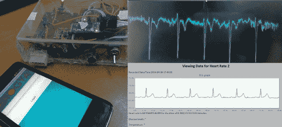

# 基于 Android 的无线 ECG

> 原文：<https://hackaday.com/2014/06/05/android-based-wireless-ecg/>

[nuclear Rambo]帖子的标题说明了一切，“基于 Android 的无线心电监护(包括温度传感器和血糖仪)。”哇！多好的项目啊！

该项目是围绕 TI 的 [HC-06 蓝牙模块](http://mcuoneclipse.com/2013/06/19/using-the-hc-06-bluetooth-module/)和 [Stellaris LaunchPad 构建的，这是一个廉价的 ARM 开发套件。](http://www.ti.com/ww/en/launchpad/launchpads-connected-ek-tm4c123gxl.html)[制作 ECG](http://hackaday.com/2014/02/23/mobilecg-goes-open-source/) 是了解[仪表放大器](http://hackaday.com/2014/02/13/arduino-powered-ecg-informs-users-of-their-death/)的好方法，仪表放大器是一种差分放大器，具有极高的共模抑制比(CMRR)。请务必记住，医疗设备存在大量的安全问题和监管问题，毫无疑问，ECG 被视为一种医疗设备。遗憾的是，[nuclear Rambo]的帖子没有包括构建该系统所需的所有代码和设计文件，考虑到这是一种医疗设备，这是可以理解的。也就是说，他提供了许多关于构建高质量 ECG 仪器和 web 界面的信息。

如果[nuclear arrambo]能贴出 Android 应用程序代码和 Stellaris LaunchPad 代码就太好了。即使有这些疏漏，这篇帖子仍然值得一读。设计医疗设备需要很多专业知识，但谁知道呢，也许你的下一个项目可以挽救你的生命！