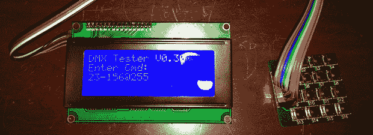

# 50 美元的 DMX 测试仪

> 原文：<https://hackaday.com/2014/05/31/the-50-dmx-tester/>

尽管 DMX 作为控制舞台灯光和烟雾机的行业标准，已经存在了和 MIDI 一样长的时间，但它仍然是一个非常昂贵的协议。在那里，MIDI 可以用一个简单的微控制器敲出来——具有奇数位速率要求，不多不少，DMX 测试仪花费数百美元。当然，这意味着 DIY DMX 测试者的市场是敞开的，在项目网站[Tony] [上正好有这个东西](http://hackaday.io/project/1179)。

对于硬件，[Tony]使用几个 4×4 矩阵键盘作为用户输入，一个字符 LCD 作为显示器。这样，他可以将 DMX 系统中 512 个照明通道中的任何一个设置为 256 个亮度值中的任何一个。将一系列通道设置为任何强度都是轻而易举的事情，而且命令协议非常简单。所有的处理都由 Arduino 处理，由于有了[概念 DMX 库](http://sourceforge.net/projects/dmxlibraryforar/files/)，Arduino 似乎更有能力处理 DMX 协议。

虽然它不是你在剧院后面找到的成熟的灯光控制台，但它足以测试灯光设备。它看起来也很容易使用，如果你想把你的大脑放在一些戏剧灯光上，这是最好的选择。