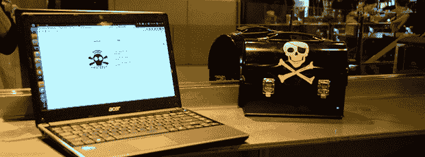

# PirateBox，满足您所有的无线投递需求

> 原文：<https://hackaday.com/2014/05/31/piratebox-for-all-your-wireless-dead-drop-needs/>

这里有一个有趣的想法:获得一个路由器，Android 设备，或 Raspberry Pi，将其放在自己的无线网络上，并允许任何人上传和下载文件。那是一个盗版盒子，是数字文化网络中的一个小节点，也是在局域网聚会上分发文件的一个非常好的方式。

在之前，我们已经见过[这种类型的东西，但是现在，多亏了【David】和【Matthias】以及其他一些人，现在有了一种简单的方法，可以将 Raspi、Android 或任何运行 OpenWrt 的东西变成无线终端。该软件还包括一个图像板(想想 chan)、一个聊天室、UPnP 媒体服务器和一个基于浏览器的文件共享系统。想分享一个“linux 发行版”？只要通过 WiFi 把它上传到盒子里，范围内的任何人都可以看到。](http://hackaday.com/2013/01/12/a-pirate-box-for-sharing-files/)

安装程序适用于你可能放在垃圾抽屉里的设备。对于您正在尝试使用的 Pi 来说，这是一个很好的选择，而且弄清楚如何完全脱离网格运行其中一个是一个有趣的挑战。