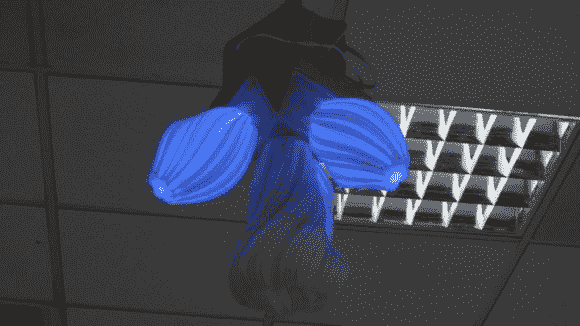

# 科赫灯是 3D 打印的扭曲

> 原文：<https://hackaday.com/2014/06/01/koch-lamp-is-3d-printed-with-a-twist/>

[repkid]并没有打算造一盏灯，但他最终还是造了一盏灯，而且他造了一盏多么好的灯啊。如果上图的形状看起来很熟悉，那是因为你不能不被 [的](http://www.thingiverse.com/thing:40504)[一个](http://www.thingiverse.com/thing:40087) [几个](http://www.thingiverse.com/thing:35246) [设计](http://www.thingiverse.com/thing:37117)绊倒，所有这些都基于一种更为人所知的分形[科赫雪花](http://en.wikipedia.org/wiki/Koch_snowflake)。然而，通常情况下，这些模型都是用来做花瓶的，但是[repkid]发现了一个机会，可以将它们放在一起，作为他的照明设备的外壳。

摆弄一个旧的[宜家 dioder](http://www.ikea.com/us/en/catalog/products/60192355/) 还不足以成为一个挑战，所以【repkid】启动了他的 3D 打印机，制造了三个更小的科赫花瓶作为灯的“灯泡”。在里面，他用透明胶带将每个 LED 灯带贴在激光切割的丙烯酸外壳上。这三个灯泡围绕着一个木制底座，底座的中心还有一个更大的科赫中心图案。底座还包含一个 PICAXE 14M2 控制器，用于运行 dioder，同时从连接的无线接收器收集输入。最后一个组件是一个定制的控制箱——由 3D 打印和激光切割部件组成——以提供一个 3 转盘遥控器。一个简单的旋转通过另一个 PICAXE 控制器将红、绿、蓝值传送给发射机。访问他的网站，获取详细的构建日志和各种进度图片。