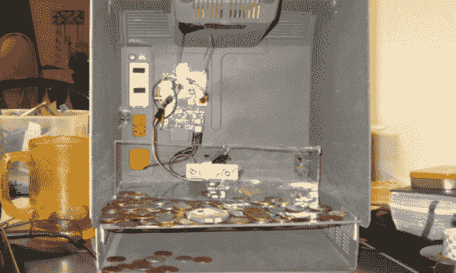

# 覆盆子 Pi 硬币推土机不会让你富有

> 原文：<https://hackaday.com/2014/06/03/raspberry-pi-coin-dozer-wont-make-you-rich/>

[SoggyBunz]幸运地从元素 14 中获得了一个最终的覆盆子 Pi 包。他的想法是用树莓皮制作一个复古机械街机硬币推土游戏，并决定在一个空的 Macintosh Plus 外壳内制作他的第一个原型。

这个游戏基于一个运行小 Python 脚本的 Raspberry Pi。Raspi 操作一个小型伺服系统，以某种随机的方式来回移动一块丙烯酸。硬币被插入麦金塔外壳上的插槽中，最终堆积起来。移动的丙烯酸杆将您的奖金推出机器，并将其存放在它上面的任何东西上，不像这台[硬币分发机。](http://hackaday.com/2013/03/09/dispensing-change-for-low-stakes-gambling/)

[SoggyBunz]承认建造有点粗糙，伺服不是致动器的最佳选择。但他的目标是建立一个更好的版本，我们只能希望他把它放在 [Hackaday.io](http://hackaday.io/) 上，给我们提示！休息后留下来观看 Pi 推土机的视频。

[https://www.youtube.com/embed/pYKVylG97Oo?version=3&rel=1&showsearch=0&showinfo=1&iv_load_policy=1&fs=1&hl=en-US&autohide=2&wmode=transparent](https://www.youtube.com/embed/pYKVylG97Oo?version=3&rel=1&showsearch=0&showinfo=1&iv_load_policy=1&fs=1&hl=en-US&autohide=2&wmode=transparent)