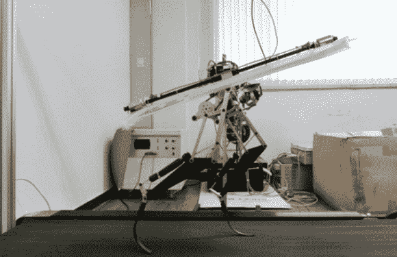

# 迅猛龙机器人准备与大狗一起奔跑

> 原文：<https://hackaday.com/2014/06/03/velociraptor-robot-ready-to-run-with-the-big-dogs/>

[朴钟元]和他在韩国高等科学技术学院的学生团队在迅猛龙的基础上创造了一个快速的双足机器人。“猛禽”的重量只有 3 公斤，身高只有 470 毫米，但它能够以 46 公里/小时的速度奔跑。这几乎和[波士顿动力公司的猎豹](http://hackaday.com/2012/09/07/cheetah-robot-can-run-down-even-the-fastest-of-us/)一样快。

猛禽使用碳纤维复合材料腿在奔跑时吸收和释放能量。该系统类似于高性能假腿中使用的系统。旋转尾翼组件进一步帮助猛禽在崎岖的地形上保持平衡。我们必须承认，对于任何可能需要与机器人互动的人来说，尾巴系统看起来确实有点危险。不过，它确实有效，猛禽跳过泡沫聚苯乙烯块就是证明。

猛禽机器人在全速奔跑时，给人的印象相当深刻。考虑到这个项目的预算与波士顿动力公司的资源相差甚远，这是一个惊人的成就。这个视频让我们想起了波士顿动力公司的创始人[【马克·雷伯特】在麻省理工学院腿实验室的早期机器人](https://www.youtube.com/watch?v=XFXj81mvInc)。我们迫不及待地想看到这支球队未来的表现。

[https://www.youtube.com/embed/lPEg83vF_Tw?version=3&rel=1&showsearch=0&showinfo=1&iv_load_policy=1&fs=1&hl=en-US&autohide=2&wmode=transparent](https://www.youtube.com/embed/lPEg83vF_Tw?version=3&rel=1&showsearch=0&showinfo=1&iv_load_policy=1&fs=1&hl=en-US&autohide=2&wmode=transparent)

[通过 Engadget]