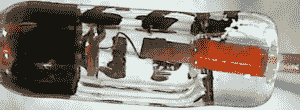
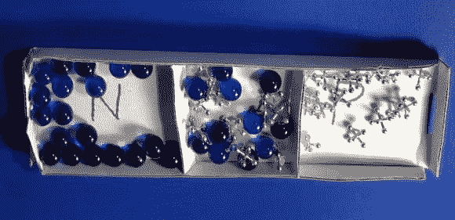
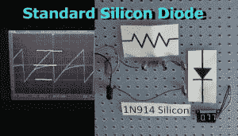
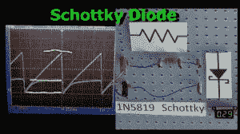
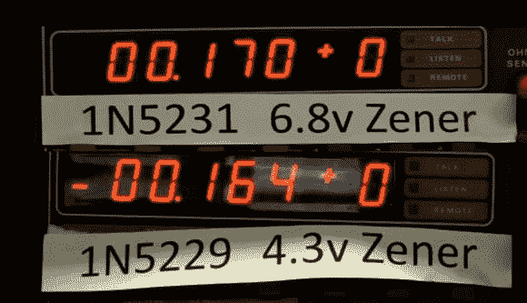
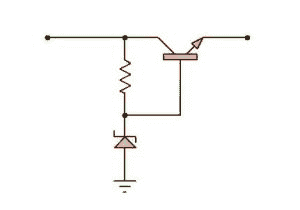
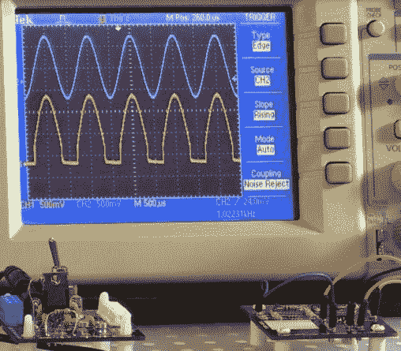
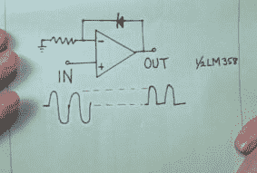
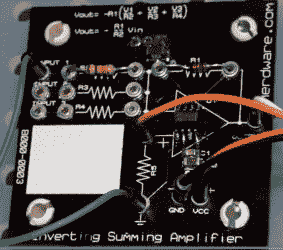

# 视频:不起眼的二极管——只用两个引脚就能实现多种功能

> 原文：<https://hackaday.com/2014/06/09/video-the-lowly-diode-umpteen-functions-with-only-two-pins/>

这个不起眼的二极管只有两根导线，却可以做很多事情。二极管可以检测，整流，抑制，发光，检测光，改变电容，发射微波等等。这种广泛的用途意味着二极管几乎包含在每一个设计中，非常值得[了解更多关于各种二极管的内部工作原理](https://www.youtube.com/watch?v=CVJ1yoXK6wI)。

[https://www.youtube.com/embed/CVJ1yoXK6wI?version=3&rel=1&showsearch=0&showinfo=1&iv_load_policy=1&fs=1&hl=en-US&autohide=2&wmode=transparent](https://www.youtube.com/embed/CVJ1yoXK6wI?version=3&rel=1&showsearch=0&showinfo=1&iv_load_policy=1&fs=1&hl=en-US&autohide=2&wmode=transparent)

和我这一代人一样，我对二极管的了解始于一台自制的水晶收音机。我的第一个二极管是一块铅笔石墨，与一把老式安全剃刀接触，两种不同材料——石墨和钢——的接合处形成了二极管。在这种配置中，二极管被称为“检测”，这是将微弱的无线电信号转变为微弱的音频信号的行为。至少在我的家乡印第安纳州马里昂，一个电台比另一个强，这样我就不用同时听两个电台了。

The venerable 1N34A Germanium Signal Diode.

我最终了解了“真正的”二极管，1N34A 锗二极管是我十几岁时的“目标”二极管。如今，仔细观察二极管，你仍然可以看到现代版本的 1N34A 与旧版本的“T0”猫须的相似之处。

可以用代表负电子和正“空穴”的弹珠和插孔来演示二极管工作方式的快速但有些不准确的模拟。空穴基本上是由于元素结合而缺少一个电子的原子，这个过程称为掺杂。休息之后请加入我的解释。

Demonstrating a PN Junction with marbles and Jacks.

在静止状态下，一些电子和空穴结合产生了一个电中性的原子，起到了绝缘体的作用，因为现在原子被锁住了，电子不能轻易地进出原子。

如果我们在相反的方向施加电压，空穴和电子就会远离中心，没有电流流动，中心区域，也就是我们所知的耗尽区，会变得更大。以使更多电子(更多“电势”)可用于 N 材料的方式连接电压，开始推动电子穿过中性势垒，这一过程称为击穿。在视频中，我展示了电子(弹球)推动耗尽的一端，在现实生活中，有一个晶格，空穴在一个方向流动，而电子在另一个方向流动，目标是展示一个简单的区别，为什么反向连接的二极管与正向偏置的二极管工作不同。

#### 肖特基和齐纳二极管

A standard Silicon Diode shown in an AC and DC circuits.

肖特基二极管提供比硅更低的正向压降，这也意味着功耗更低。为了快速了解硅二极管和肖特基二极管之间的差异，我们对器件施加了 1v 斜坡信号，并直观展示了如下所示的差异。

Demonstrating a Schottky diode in an AC and DC circuit.

需要注意的是，这不是使用这些器件的常见方式，这主要是为了显示二极管选择可能影响的 1 伏信号的比例。过去，我们主要在 RF 应用中看到肖特基二极管，因为其低电容和快速恢复时间在高频下工作良好。

我年轻时获得的另一条信息是，许多齐纳二极管并不是真正的齐纳二极管，它们实际上是雪崩二极管。也就是说，它们的行为确实很像齐纳的表亲，因此缺乏明显的差异使得用户可以不加区别地使用它们。

唉，在时间之前的*，没有互联网来查找或验证这样的事实，所以一个人几乎必须提交脑细胞来存储半有用的事实，以防有一天会被需要。我也必须承认，我很好奇，如果我能告诉这两者之间的区别，所以出现了 5 位数字 Keithly VOM 和热枪。*

Voltage change with heat: Avalanche diode on top, Zener on bottom.

事实证明，齐纳二极管和雪崩二极管之间的识别可以通过检查它是否具有正系数或负系数(对热的反应)来确定。图中所示为电表调零和二极管加热后的两个不同的电压二极管。一个有趣的事实是，在 5.6V 左右，击穿电压大约一半来自齐纳效应，一半来自雪崩，这导致温度特性趋于抵消。

如果这次讨论让你想到了温度变化的影响，请务必观看我的视频[关于计算元件热量的视频](https://www.youtube.com/watch?v=H6lmt7AwMf0)。

#### 原始电压调节

Common Base voltage regulator.

当时，一种非常常见的电压调节器是由一个共基极配置的功率晶体管制成的，基极电压由 5.6v 齐纳二极管设置。这里显示的电路是一个有点粗糙的调节器，不具备我们假设的 3 端调节器的负载调节和其他特性。

如果器件规格正确，二极管是齐纳二极管还是雪崩二极管(或两者兼有)并不重要，但瞬态电压抑制二极管往往是雪崩型的除外。

最后，当使用正向压降显著的模拟电路时，可以使用运算放大器来克服压降，同时仍然提供定向传导。在这种情况下，二极管包含在负反馈环路中，大部分不良效应被抵消。这里显示的是一个简单的整流器，该电路的各种变体进入峰值保持电路和音频检测器。

  Oscilliscope showing diode in an opamp feedback loop  Low voltage drop Diode: Diode contained within an Op Amp feedback loop.  Op Amp with Diode in negative feedback loop.