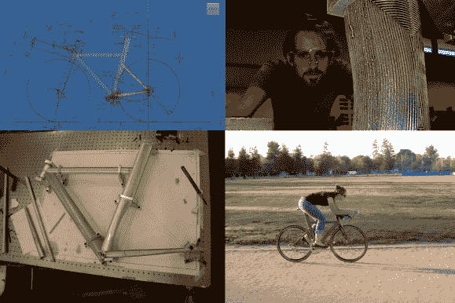

# 一辆单人自行车

> 原文：<https://hackaday.com/2014/06/06/a-bicycle-built-for-one/>

当他着手为妻子打造一辆定制计时赛自行车时，他一定是在争夺年度丈夫。我们也不仅仅是在谈论将几个零件栓接在一起——他从头开始设计、切割、焊接和油漆整个框架。[计时赛](http://en.wikipedia.org/wiki/Time_trial_bicycle)是自行车比赛的一种非常特殊的形式。自行车是为速度而生的，但是[牵引](http://en.wikipedia.org/wiki/Drafting_(racing))是不允许的，所以自行车和骑手的空气动力学成为关键。定制自行车价值数千美元，但作为贫困的大学生，无论是[Bcmanucd]还是他的妻子都买不起一辆合适的自行车。自行车项目就这样诞生了。

[Bcmanucd]根据他妻子的自行车教练提供的体能评估创建了基本几何图形。他在 Autodesk Inventor 中设计了整辆自行车。一旦设计完成，就该订购材料了。之所以选择 7005 铝合金，是因为它不需要[固溶热处理](http://en.wikipedia.org/wiki/Heat_treating)，只需要一趟烤箱就可以释放焊接应力。每个内胎都利用独特的横截面来减少阻力，所以[Bcmanucd]必须从专业自行车供应商那里订购原材料。

一旦所有的材料都在里面，[Bcmanucd]把他的机械工程学位放在一边，戴上他的工作手套。像所有学生一样，他可以去加州大学戴维斯分校的机械车间。他使用车间的数控改造布里奇波特轧机来切割头管和辍学。

这一过程中最微妙的部分是将所有零件对齐并焊接。这对[Bcmanucd]来说不成问题，因为他使用了激光桌和他自己的夹具来保持一切完美排列。任何焊工都会告诉你，与铝一起工作需要一些经验。由于这是[Bcmanucd]的第一个大型铝项目，他对废金属进行了几次测试，以确保他的 TIG 焊机设置正确。焊缝清理得很好，证明是牢固的。

整个建造过程耗时约 3 个月，刚好赶上本赛季的第一场比赛。事实上，在最初的几场比赛中，这辆自行车甚至还没有上漆。尽管如此，他的妻子似乎并不介意，因为那年她骑着它赢得了全国女子团体计时赛冠军。这辆自行车后来成为了[Bcmanucd]的“滚动简历”，并帮助他在自行车行业找到了梦想中的工作。

响应[Bcmanucd][Reddit 帖子](http://www.reddit.com/r/DIY/comments/27dv60/i_made_a_bicycle_for_my_wife/)的置顶评论，我们想说干得太棒了——但是慢点，你让我们这些懒惰的配偶看起来很糟糕！