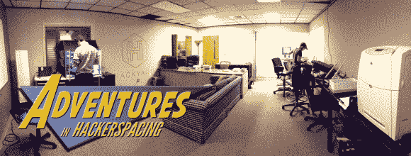
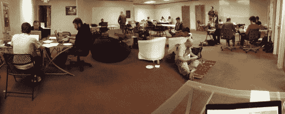
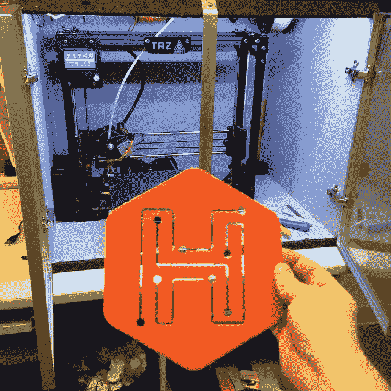
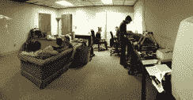
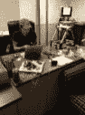
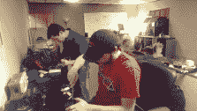
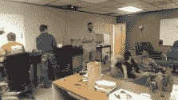

# 黑客空间历险记:雅典黑客花园，第一部分

> 原文：<https://hackaday.com/2014/06/11/adventures-in-hackerspacing-hackyard-athens-part-i/>

很有意思的是，这一切这么快就走到了一起。如果你所在的地区有黑客空间或创客空间，我希望你已经去看看它是什么样子的。如果没有，你随时可以开始你自己的…

这个概念看起来很简单，不是吗？召集几个志同道合的人，找一个空间——任何空间——把他们和一些设备塞进去。然而，两年的围捕和强行推进足以让最有激情的潜在黑客空间者望而却步。从所有的预测来看，在佐治亚州雅典建立一个黑客空间的努力是一场马拉松，是一个渐进的过程，最终形成一个来之不易的工作空间。但事实并非如此。雅典的 Hackyard】应运而生。

仅在一周内。

不要把这个总结误认为是在吹牛:事实并非如此。我仍然不明白我们是如何走到这一步的。这是一个困惑的宣言，尽管没有人抱怨。在这一集《黑客空间历险记》中，我将详细讲述一个空间最早的开始阶段，直到空间本身的启动。

我开始写这个专栏是为了记录我所在城镇的黑客空间的形成，但我从来不觉得有足够的内容可以分享。谁想听在一个体育酒吧两周一次的几个小时的会议，一年后，相当于几个熟人和未实现的希望和梦想？相反，我转向我在 [Freeside Atlanta](http://wiki.freesideatlanta.org/fs/Info) 的朋友，进行了两部分的幕后对话([第一部分](http://hackaday.com/2013/10/14/adventures-in-hackerspacing-freeside-atlanta-part-i/) & [第二部分](http://hackaday.com/2013/10/21/adventures-in-hackerspacing-freeside-atlanta-part-ii/)，如果你错过了他们的话)。如果我对雅典的场景没有什么可报道的，至少我可以从一个成功的空间得到一些指导，并将他们的经历传达给黑客读者。

## 酒吧聚会

与此同时，我和一位从事工程的朋友合作，在当地的一家酒吧里进行非正式的会面。该计划包括通过一个 Meetup 小组和一个月两次的会议来讨论项目和问题。结果很大程度上是成功的，每次派出大约 10-15 人，尽管有几个人接近 25-30 人。这类活动提供了一个低压力、友好的社交环境:很容易吸引某人外出度过一个休闲的夜晚。Freeside 是从亚特兰大一家酒吧的类似聚会发展而来的(尽管你很难将雅典团体与 [DEFCON404 的](http://dc404.org/)相比，后者似乎对定期、高质量的会议无止境的奉献)。

尽管吸引志趣相投的人参加你的聚会相对容易，但在酒吧和餐馆见面还是有一些问题。座位安排往往会限制你能和多少人聊天，任何分享一个项目的人最终都会被一小群人包围，而他们后面的人则努力倾听。你还保证至少会被打断三次——下订单、订单到达、订单付款——其严重程度因店而异。

你也不拥有这个空间。任何展示和说明的项目或项目都必须运进来，除非你决定以后一起出去，否则很少有机会一起工作。我们认为，自然的进展是鼓励我们的与会者走到一起，建立一个黑客空间。这个想法很受欢迎。结果是一场灾难。

不要试图在感恩节前后在大学城创建一个黑客空间。我们知道随着假期的临近，上座率会下降，但我们在几周前推出了空间选项，这是一个糟糕的决定。我和我的朋友已经侦察了潜在的地点，拍了一些照片，算出了一些数字。当我们在下一次会议上展示我们的发现时，节日气氛已经侵蚀了我们小组的动力。上座率没有下滑，而是直线下降。我们的 hackerspace 项目吸引了 5 名而不是 30 名观众，有些人对每月支付空间使用费持保留态度。感恩节结束时，大学正在进行期末考试，紧接着是寒假和随之而来的一系列假期。

新的一年和两次人口稀少的会议后，它死了。

## 黑客马拉松和新社区

我不想放弃，但我也不想在没有休息和重新考虑方法的情况下再次冲锋。当一个朋友告诉我另一个当地团体正在尝试创建一个黑客空间时，我松了一口气。在联系了负责人之后，我了解到这个组织得到了一个支持当地技术社区的非营利组织 FourAthens 的帮助。尽管 hackerspace 小组刚刚起步，但通过与 FourAthens 的合作，他们已经建立了一个可以引起兴趣的社区，并可以进入活动空间。

计划是每月举行一次黑客马拉松活动，吸引人群，让人们参与其中。黑客马拉松的形式相对不受限制:没有主题限制，并且允许预先计划，但整个挑战仅用了四个小时。与酒吧/餐馆会议相比，黑客马拉松更吸引人，也更有趣，仍然吸引了很多人。第一场至少有 40 人来，虽然只有 15-20 人参加。这种新方法看起来不错。

然而，几个月后，黑客马拉松的形式暴露了一些潜在的问题。四个小时时间不多。如果你想完成一个令人印象深刻的计划，你需要在一周内花相当多的时间做一些预先计划。但是，当你出现时，你就是“那个人”一个有很多桶东西的人，从几天的准备中积累起来的。你不是在黑，你是在组装。

另一种方法是我称之为“童子军”的方法:带上你所有的设备和部件，与一个新朋友合作，当场想出一个项目。你通常不会完成。

> 这次活动与其说是一次社区体验，不如说是一次公众示威。

四小时制也限制了第一次上课的人的选择。当一个门外汉对电子产品的经验仅限于给手机充电时，他/她很难涉足硬件黑客领域。新手太害怕了，有经验的黑客太忙了。这次活动与其说是一次社区体验，不如说是一次公众示威。就像看一个好战的文艺复兴集会吹玻璃工人，他避免眼神接触，在即兴研讨会上四处奔忙，被一群好奇为什么疯狂的人流血的人看着。更糟的是，他为什么不在乎？

随后的黑客马拉松变成了采访会议。相对来说，已经很少生产了。相反，我们向好奇但距离较远的游客解释事情。随着夜晚的推移，4 个小时的比赛接近尾声，越来越少的黑客有什么可展示的。我喜欢黑客马拉松的形式，但它不太适合一个努力生存的团队。兴趣和人数都减少了。同样，对永久空间的探索也停滞不前。感觉又是一个死胡同。

## 后院

当我说雅典的 Hackyard 爆炸式地形成时，我有点夸张了。几个月来(或者几年，取决于你是谁)，这个社区已经受到来自不同方向的刺激，并且有一个利益相关方的基础。

我们中的一些人决定尝试一些不同的东西，并分裂出去建立了 Hackyard。计划？启动它。筹集足够的钱去租东西。任何事。不到一周，我们就搬进了一个空间，里面装满了很酷的东西。Hackyard 的位置——与当地科技孵化器的办公室相同——保证了大量的行人经过，并想知道发生了什么。Hackyard 目前每周四定期举办开放日，这让这些新人有机会在一个低压力(对双方而言)的环境中与我们见面。

如果说我从这次经历中学到了什么，那就是重叠的技能组合在开始时并不是很有用。最初的会议挤满了书呆子，但没有人知道如何处理一个非营利组织。然而，创建 Hackyard Athens 的我们四个人是软件、硬件、图形、网络和商业经验的完美结合。我们都是好朋友。除了[汤米]和他那顶愚蠢的帽子。

随着篇幅的增长寻找下一集！

  Turned out to be a great hangout space.  Me pretending to work on the printer.  Not too cramped, still productive!  A mere instant before [Jordan] takes a Nerf dart to the face