# 近距离观察新物质的 MOD-t 3d 打印机

> 原文：<https://hackaday.com/2014/06/09/a-closer-look-at-newmatters-mod-t-3d-printer/>

因此，上周供应框架办公室 Prusa i3 终于放弃了幽灵——z 轴螺纹杆从它们的连接器上松开，整个事情就分崩离析了。因此，我们需要一些更好的连接器，因为我们的管道不再适用。谢天谢地，帕萨迪纳到处都是 3d 打印机的人！在我们办公室的几个街区之内，我们有了新的产品 DeezMaker，以及 ToyBuilderLabs 即将推出的 3d 打印机。

现在每个人都在谈论的一个人是[新事物](http://www.newmatter.com/)，他最近宣布[已经为他们 250 美元的 3d 打印机 MOD-t 的首次运行成功筹集资金](https://www.indiegogo.com/projects/new-matter-mod-t-a-3d-printer-for-everyone)，这最近一直在流传，因为它的低价和将 3d 打印带入大众家庭的明确目标(这是一个古老的故事，对吗？).这肯定是一个可爱的目标，但他们肯定有自己的工作要做，但也许这是实现这一目标的团队？我们决定前往他们的实验室，因为它就在我们办公室的拐角处，看看我们是否可以让他们打印一些新的耦合器，也许在我们工作的时候看看他们的打印机，休息后看看视频和图片！

### 机械师

他们一直在与青蛙合作设计一种 3d 打印机，人们在家里会很舒服，我们认为他们在这方面做得很好。它看起来很漂亮，但我们是黑客，所以我们想看看引擎盖下。虽然他们还没有最终模型的工作版本，但我们确实近距离亲自看到了他们的一个原型。老实说，我们还没有见过比这更少组件的 3d 打印机，他们真的成功地将其归结为最基本的要素，同时仍然保持其功能。看一下图片…

 [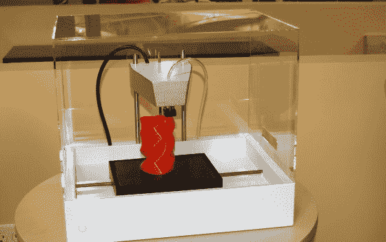](https://hackaday.com/2014/06/09/a-closer-look-at-newmatters-mod-t-3d-printer/olympus-digital-camera-69/) Front of the New Matter production model. [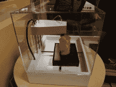](https://hackaday.com/2014/06/09/a-closer-look-at-newmatters-mod-t-3d-printer/olympus-digital-camera-65/) Side shot of the New Matter production model [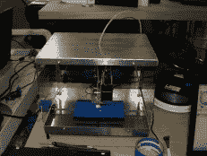](https://hackaday.com/2014/06/09/a-closer-look-at-newmatters-mod-t-3d-printer/olympus-digital-camera-67/) The first MOD-t prototype [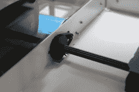](https://hackaday.com/2014/06/09/a-closer-look-at-newmatters-mod-t-3d-printer/img_9234/) That’s the entire Y axis mechanism, simple huh? [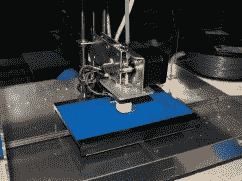](https://hackaday.com/2014/06/09/a-closer-look-at-newmatters-mod-t-3d-printer/olympus-digital-camera-68/) Even the extruder is simple [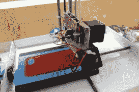](https://hackaday.com/2014/06/09/a-closer-look-at-newmatters-mod-t-3d-printer/img_9236/) The New Matter MOD-t prototype

他们关键的机械设计突破是他们的齿条齿轮驱动 XY 床，他们设法取消了所有的轴承，光滑的杆和螺纹杆螺钉，并用床坐在上面的两个小齿轮的简单机构代替它们。床本身是一个简单的塑料块，下面附有齿条，它位于小齿轮上，然后在 XY 轴转动时被驱动。这真的很巧妙，但我们不得不怀疑这是否会有任何负面问题，例如灰尘和其他污物会卡在齿轮系统中吗？齿轮中有间隙吗？构建板在高速时会反弹吗？

我们就此询问了 New Matter 的 CTO[Steve Schell ]:

> 当工作台沿着杆的长度滑动时，任何小碎片在小齿轮杆上都会被扫走(记住齿条和小齿轮的界面既啮合又滑动)。大的碎片可能会引起问题，但在我们迄今为止的测试中，我们还没有看到任何这种类型碎片的真正来源。

我们还仔细观察了齿轮系统，当它转动时，系统中的齿隙(如果有的话)非常小，[Steve]说他们非常小心地选择正确的齿条和小齿轮，并确保他们的装配过程符合严格的公差，似乎已经完成了工作。最后，构建板显然足够重，即使在较高的速度下也能保持在引脚上。他们获得了 80 毫米/秒的打印速度和 200 毫米/秒的最大旋转速度，这是相当可观的设计，他们说，在这个速度下，他们的床没有任何问题。查看下面的视频，在打印过程中更近距离地观察床身。

可移动床确实是齿条齿轮设计的一大优势，不再需要打印机拆卸零件，只需将床拆下来，放在一边冷却，再放入另一个床，即可立即开始打印。我们问[史蒂夫]他们是否计划出售替换床，但他们还不确定价格或何时可以买到。

> 我们确实计划出售备用/替换床，但还没有确定价格。这不是很贵的部件，但我们需要考虑包装、搬运、运输等因素。以便确定零售价格。

我们也很担心我们看不到调平床的机制，以下是史蒂夫所说的:

> 由于床相对于静止的挤出机在两个水平轴上移动，所以绝对不需要对床进行调平。我们的测试证实了这一点，因为我们在原型的构建或校准中没有做任何事情来校正任何类型的基床调平。第一层良好一致的粘合所需的全部条件是:( a)直齿轮杆，我们通过供应商和我们的制造过程对其进行控制;( b)构建板及其模制齿条的严格公差，我们也在制造过程中对其进行控制。

这就把我们带到了他们的制造过程。我们都喜欢开源设计，遗憾的是 MOD-t 不是开源的。但这似乎很大程度上是由于他们将用于生产机器的制造工艺。虽然他们可以开源它，但谁会真的用定制的电路板、注射成型的零件和机械加工的组件来复制设计呢？他们也一直在努力寻找合适的供应商，让他们达到 250 美元的价格点，而不是破产。例如，他们使用光学编码器和 DC 电机进行精确定位，这在小批量生产中通常非常昂贵，但由于他们计划生产数万台，他们可以开始规模化生产，使其比步进电机更具成本效益。

### 软件

软件方面的事情仍在大力发展，他们计划最终有一个单一的'按钮打印'的方法，从他们的商店在浏览器中。这确实是该设备进入大众市场的必要条件，因为我们真的不认为你可以使用 Slic3r 或 Skeinforge 获得更广泛的消费者市场！因此，他们将商店控制得非常严格，商店上的一切都应该开箱即可完美打印，没有校准，没有乱动设置等。因此，商店本质上是由 DRM 控制的，更多的是出于需要而不是其他。

这并不是说机器本身是，虽然，我们已经得到保证，它需要标准的 GCode 和标准的 PLA 1.75mm 毫米灯丝。您通常在 reprap 或类似设备上使用的任何控制软件都可以工作。当然，你会像使用所有 3d 打印机一样，不得不调整设置，但这就是代价。

### 指纹！

New Matter 非常友好地为我们的打印机打印了 2 套新的[whoswahis ' Buko Z coupler v2](http://www.thingiverse.com/thing:22422),结果相当不错，在不拆卸所有部件的情况下，安装在我们的机器上并不太困难。当然，我们搞砸了，这些耦合器与我们的 X 轴部件不匹配，这意味着我们需要抬高床，花更多的时间摆弄打印机，而不是实际打印东西。

捕捉下面的一些 MOD-t 原型的近距离动作镜头视频，让我们知道你对机械设计的看法！

[https://www.youtube.com/embed/HtYBNwyAIR8?version=3&rel=1&showsearch=0&showinfo=1&iv_load_policy=1&fs=1&hl=en-US&autohide=2&wmode=transparent](https://www.youtube.com/embed/HtYBNwyAIR8?version=3&rel=1&showsearch=0&showinfo=1&iv_load_policy=1&fs=1&hl=en-US&autohide=2&wmode=transparent) [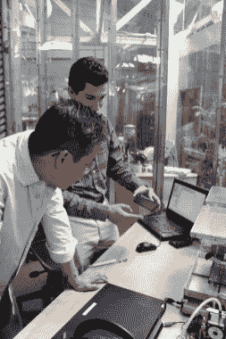](https://hackaday.com/2014/06/09/a-closer-look-at-newmatters-mod-t-3d-printer/img_9219/) New Matter engineers explaining the print bed mechanism [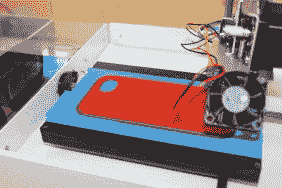](https://hackaday.com/2014/06/09/a-closer-look-at-newmatters-mod-t-3d-printer/img_9255/) MOD-t printing a phone case  The Hackaday sticker makes the laptop go faster. [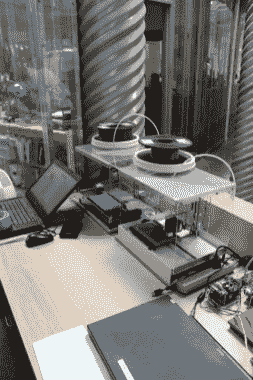](https://hackaday.com/2014/06/09/a-closer-look-at-newmatters-mod-t-3d-printer/img_9257/) New Matter’s workbench is as simple as their printer! [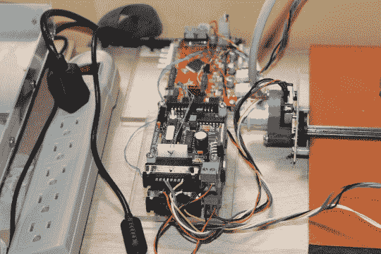](https://hackaday.com/2014/06/09/a-closer-look-at-newmatters-mod-t-3d-printer/img_9259/) Prototype electronics, this will all be optimized and shrunk for production. [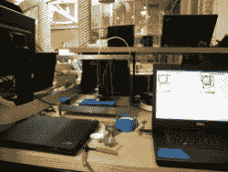](https://hackaday.com/2014/06/09/a-closer-look-at-newmatters-mod-t-3d-printer/olympus-digital-camera-66/) Calibrating!  Some sample prints out of the MOD-t prototype