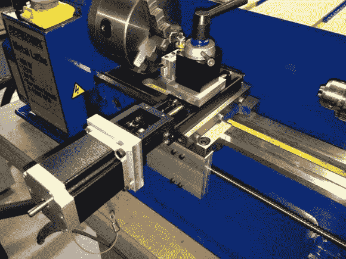
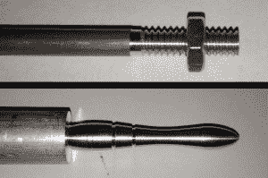

# 车床数控升级是没有什么可动摇的

> 原文：<https://hackaday.com/2014/06/06/lathe-cnc-upgrade-is-nothing-to-shake-a-turned-stick-at/>

我们在 Hackaday 上看到很多 CNC 机器，但没有太多是基于车床的。[Jim]给我们发了一封电子邮件，让我们知道他对缺乏数控车床的不满，并附上了一个链接，指向他最近的一个项目，将一台小型手动车床转换为计算机控制。这不是一些“T0”在一些步进器上的“T1”类型的项目，这是一个能够紧密公差和线程的完全成熟的[版本](http://www.embeddedtronics.com/cnc_lathe.html)。

该项目基于一台 7×12 微型车床。有几个品牌可供选择，它们几乎完全相同。看看这个[对比](http://littlemachineshop.com/info/minilathe_compare.php)。[吉姆]从霍米尔品牌开始。

第一个升级的东西与数控转换无关。3”卡盘被替换为 5”卡盘。使用为这项任务制作的转接板，更换它很容易。对于 X 轴，导轨和丝杠被移除，并由 THK 线性滑轨代替。这个滑块只有 2.5 英寸的行程，非常适合这种应用。行程如此短暂，使得易贝的最终拍卖价格低于 40 美元。

就像 X 轴库存硬件，所有的 Z 轴部分也被抛弃，有利于另一个易贝发现，一个 10 毫米滚珠丝杠和螺母。[吉姆]不得不自己做支架，把马达安装到床上，把滚珠螺母安装到马车上。新支架以与库存零件相同的方式用螺栓固定在机器上，使安装变得稍微容易一些。

车床由运行 Mach3 的旧奔腾 4 计算机控制。步进和方向信号通过并行端口离开计算机，到达一对 Gecko 步进电机驱动器。自制电源为 NEMA23 步进电机提供 36vdc。霍尔效应传感器安装在主轴上，并将主轴速度信息反馈给 Mach3，以便它可以在切割螺纹时对步进命令进行计时。最终的结果是一个甜蜜和有能力的车床，我们很高兴地将它添加到 Hackaday 上的 CNC 机床列表中。

[https://www.youtube.com/embed/zuGZxvZJS_w?version=3&rel=1&showsearch=0&showinfo=1&iv_load_policy=1&fs=1&hl=en-US&autohide=2&wmode=transparent](https://www.youtube.com/embed/zuGZxvZJS_w?version=3&rel=1&showsearch=0&showinfo=1&iv_load_policy=1&fs=1&hl=en-US&autohide=2&wmode=transparent)