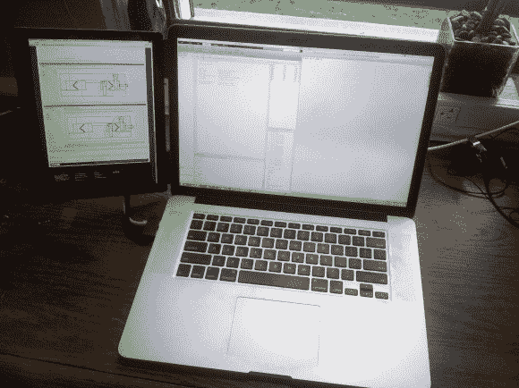

# 定制的 IPad LCD 屏幕夹在 Macbook 上，作为光滑的第二块屏幕

> 原文：<https://hackaday.com/2014/06/07/customized-ipad-lcd-screen-clips-onto-macbook-as-a-slick-second-screen/>

去年，[本]在 iPad 3 液晶显示屏上发现了一个好交易。他忍不住买了一对来玩。他很快就意识到，在任何一台电脑上使用这些液晶显示屏其实很简单。这是因为液晶面板有内置的苹果显示端口接口。这意味着您可以将自己的显示端口连接器添加到 LCD 带状连接器的末端，并将其插入计算机。你还需要安装一个背光驱动装置，这是[本]能以 35 美元左右的价格找到的预制装置。

然而，黑客攻击并没有就此停止。[本]想要一个漂亮的成品。他用激光切割了一个非常适合 LCD 屏幕的亚克力边框。然后，他磨出一个空间来安装液晶显示器。丙烯酸树脂的厚度足以容纳屏幕和所有的电缆。为了掩盖背面，[Ben]选择使用 PowerMac G5 电脑机箱的侧面板。他选择这个主要是为了审美。他就是无法抗拒漂亮的拉丝铝合金外观和巨大的苹果标志。这将是他的 Macbook 的完美搭配。

一旦液晶面板看起来不错，[本]仍然需要一种方法来安全地将其固定在正确的位置。他知道他想把它放在他的 Macbook 旁边，那么为什么不直接把它挂在 Macbook 上呢？[Ben]开始用他的 3D 打印机打印一些小塑料夹子。夹子粘在 iPad 屏幕的丙烯酸边框上，可以在几秒钟内轻松夹在 Macbook 屏幕上。这样，他的笔记本电脑仍然是便携的，但当他需要时，他有额外的屏幕空间。[Ben]还打印了一个塑料夹子，将 iPad 的 USB 电源连接器和显示器端口连接器变成一个连接器。虽然这显然不是必需的，但它确实有效地将两个独立的插件变成了一个，使整个项目更加流畅。