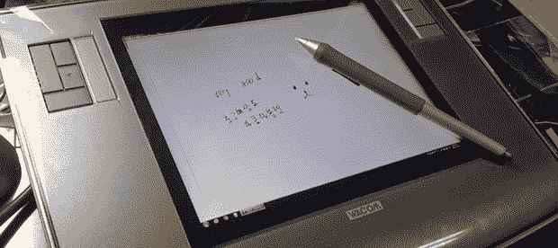

# 将 Wacom Intuos 转换为 Cintiq

> 原文：<https://hackaday.com/2014/06/08/converting-the-wacom-intuos-into-a-cintiq/>

为数字艺术家提供优质手写板的 Wacom 公司基本上有两条手写板产品线。第一个是 Intuos，这是一个很棒的手写板，让艺术家能够将电脑变成一个虚拟的枯树笔记本。第二个产品线 Cintiq 采用了相同的技术，并在组合中添加了一个 LCD，有效地将绘图板变成了第二个显示器。[Bumhee]想要一台 Cintiq，但不想支付 Cintiq 的价格，[导致他在他的旧 Intuos 平板电脑](http://forum.bongofish.co.uk/index.php?topic=2379.0)中安装了显示屏。这是一个令人惊讶的简单构建，让我们认为我们将在未来看到他的工作的一些衍生物。

用于此修改的显示器[Bumhee]是来自 iPad 的 Retina 显示器。使用合适的适配器，您可以轻松地[将这些显示器中的一个连接到计算机](http://hackaday.com/2013/04/22/connect-a-retina-display-to-a-regular-computer/)，为您提供一个非常薄的 2048×1536 9.7 英寸显示器。最初的测试是为了看看这个 mod 是否能在他的平板电脑上工作——移除显示屏上的金属屏蔽，将其放在平板电脑上，然后绘图——取得了成功，这让[Bumhee]有信心对他的平板电脑进行不可挽回的修改。

从那时起，修改是一个简单的事情，切开平板电脑的外壳，用几个螺丝安装显示器，并在显示器上安装一块玻璃。非常简单，而且这几乎是你以不到 1000 美元的价格买到一台带有小尺寸高分辨率显示屏的数位板的唯一方式。

谢谢[大卫]送来这封信。