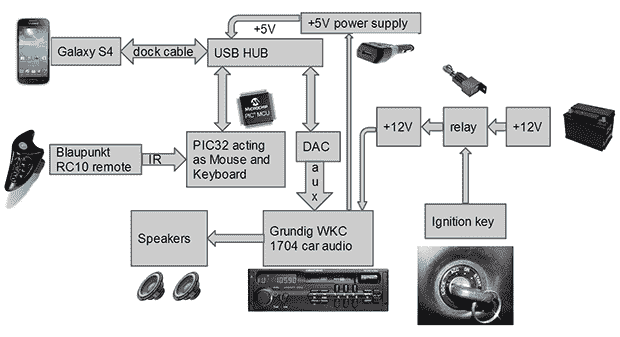

# 头部单元对接站

> 原文：<https://hackaday.com/2014/06/09/a-head-unit-docking-station/>

[Ivan]有一个简单的想法:能够从汽车转向柱上的小键盘控制他的 Android 设备。这将使他能够在应用程序、导航和音轨之间循环切换，而双手永远不会离开方向盘。然后功能蠕变开始出现，[Ivan]问自己如何通过相同的界面给他的手机充电。他最后得到的是[一个头单元，也是一个坞站](http://www.ivancreations.com/2014/06/car-cassette-head-unit-becomes-dock-for-galaxy-s4.html)。

虽然[Ivan]的方向盘上没有新型汽车上的集成遥控按钮，但他有一个 Blaupunkt 遥控器，这是一个小型的夹式控制器，上面有一个红外发射器。红外接收器连接到 PIC 微控制器，向手机发送上、下、左、右、菜单和主页命令。电话的音频输出由连接到 USB 集线器的小型 USB 声卡处理，将音频信号直接发送到主机的放大器中。

在 USB 主机模式下给手机充电是这个版本的关键部分；不能在长途汽车旅行中充电会很快耗尽电池，使汽车停靠站变得毫无意义。为了实现这一点，[Ivan]在 USB 端口中模拟了一个带有几个电阻的 Galaxy S4 坞站，允许手机控制 USB 声卡，收听模拟的键盘和鼠标，并同时充电。

这不是一个漂亮的建筑，但它非常有用。在视频中，你可以看到[Ivan]几乎是从他周围的东西中拼凑出来的——很好地重复利用了垃圾，同时也是他的汽车的一个很好的补充。

[https://www.youtube.com/embed/tl2wppOkXC0?version=3&rel=1&showsearch=0&showinfo=1&iv_load_policy=1&fs=1&hl=en-US&autohide=2&wmode=transparent](https://www.youtube.com/embed/tl2wppOkXC0?version=3&rel=1&showsearch=0&showinfo=1&iv_load_policy=1&fs=1&hl=en-US&autohide=2&wmode=transparent)

[https://www.youtube.com/embed/L6GPUx3Fpos?version=3&rel=1&showsearch=0&showinfo=1&iv_load_policy=1&fs=1&hl=en-US&autohide=2&wmode=transparent](https://www.youtube.com/embed/L6GPUx3Fpos?version=3&rel=1&showsearch=0&showinfo=1&iv_load_policy=1&fs=1&hl=en-US&autohide=2&wmode=transparent)