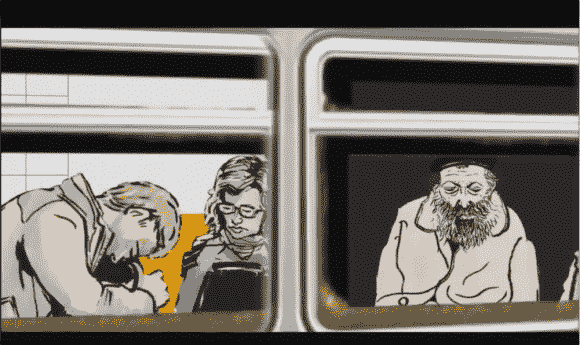

# 纽约电阻器通过 2014 年互动展让纽约升温

> 原文：<https://hackaday.com/2014/06/13/nyc-resistor-interactive-show-2014/>

在布鲁克林一个毫不起眼的码头后面，矗立着一座普通的砖砌建筑。走上 3 段狭窄的楼梯——你会发现自己来到了被称为[纽约电阻器](http://www.nycresistor.com/)的令人敬畏的门前。上周六，纽约电阻器举行了他们的第五次互动表演，Hackaday 在那里！就像它称之为家的城市一样，互动展是一个大熔炉。这个特殊的罐子里装满了展示他们项目的纽约抵抗组织成员(和公众)，NYU 的 ITP 提什学校的学生展示他们的互动艺术，还有相当一部分老式的黑客聚会。

我首先被这座建筑打动。他们在布鲁克林有一个很大的空间。19 世纪晚期的阁楼，最初是联邦酿酒公司 T1 的一部分。在古老的砖墙、拼凑的锡天花板、Devo 海报和 led 灯之间，它拥有人们对这样一个空间的所有疯狂科学家实验室的魅力。

事件本身发生在两个房间里。前屋有 DJ，还有昏暗的灯光。当我听到砰砰的音乐时，我想我会看到典型的 DJ 灯和闪光灯。我大错特错了！这里不需要这样；LED 项目为整个房间提供了充足的闪光灯。

我穿过观看两个玩家在 [Megascroller](http://hackaday.com/2014/06/05/the-megascroller-for-video-games-in-the-round/) 上比赛的人群，发现自己在后面的房间里，那里展示着大多数项目。

[Daniel Luxemburg]首先出场，他的 [leap-lifx，](https://github.com/dluxemburg/leap-lifx)是一款基于 Leap Motion 的 LIFX RGB LED 灯泡控制器。奥利维亚·巴尔展示了她的[而不是相机](http://notacamera.tumblr.com/)。希望她现在能找到我留在上面的自拍照。

摄像机旁边是奥利维亚·巴尔的[打屁股力量测试](https://www.youtube.com/watch?v=woMSuxtQhsk) (YouTube 链接)。一个装饰着连体袜的人体模型，用安装在尾部的传感器来测量打屁股的力度。结果当然会显示在服装正面的发光二极管上。

藏在前屋角落里的是整个事件中最突出的一个。[地铁故事](http://www.subwaystories.net/)是[ [阿龙·奇塔亚特](http://www.animishmish.com/)和[ [杰夫·翁](http://www.ongdesign.com/)的创作。用户戴上耳机，使用金属盒上的两个杠杆与耳机互动。一个杠杆加速火车，而另一个放大乘客。当每个骑手进入视野时，你可以通过耳机听到他们的想法。背景中充满了地铁的声音。这种体验令人难以置信地身临其境。谁没有坐过地铁，好奇角落里那个家伙在想什么？一台 Arduino 将杠杆输入转换为串行输入，然后输入计算机运行草图进行处理。音频由 Max/Msp 处理。

大约午夜时分，所有人都聚集在前屋，观看布鲁克林芭蕾舞团的表演。两名舞者展示了芭蕾舞团和纽约抵抗组织成员【尼克和神田沙也加·弗米尔】【奥利维亚·巴尔】和【威廉·沃德】合作制作的服装。其中一名芭蕾舞演员穿着一件降雪短裙——一件带有加速计控制的白色 led 的白色短裙，随着舞者的动作产生降雪效果。

流行艺术家[迈克“至尊”菲尔兹]展示了他的 Pexel 衬衫。装有发光二极管，[迈克]通过移动肌肉群完全控制了衬衫。每块胸肌上的加速计使他胸部的发光二极管闪烁，而他手腕上的加速计使他的手臂发出一道道光线。

晚会的舞蹈部分一结束，我就回到了酒吧，在那里我品尝了 NYCR 成员[Travis Collins]和[Matt Joyce]为这次活动制作的家酿啤酒。除了啤酒本身，他们还用 20 世纪 50 年代的 Leonard 冰箱制作了一个双龙头啤酒桶。

[Sophi Kravitz]巧妙地位于酒吧旁边，有一个升级版的她的[心跳音箱](http://hackaday.com/2013/10/22/heartbeat-boombox-creates-bio-beats/)。这个版本包括更新的前面板和更时尚的整体设计。

我碰到了[Amit Klein]，他正在炫耀[魔镜咪咪](http://startupgiraffe.com/introducing-mimi-the-magic-mirror/)。镜子由运行 Android 的四核 i.mx6 WandBoard 驱动，展示了帮助人们完成早晨日常工作的演示。它还运行了一个演示，用户可以观看动画并模仿动作。然后镜子会显示原始动画，用户的视频就在它的下面。

就在这个时候，一群人聚集在前厅，这只能意味着一件事——马里奥在巨型滚动条上运行起来了。马里奥回合结果是一个相当有趣的派对游戏，为每一个成功占领的城堡欢呼。我的个人最好成绩是在马里奥超过我之前，在棋盘上走了一半，然后直接撞上了一个古姆巴。

随着凌晨时分的临近，人群逐渐减少，但纽约抵抗组织的成员仍然很强大。我来到这座城市，看到一些最优秀的人才仍在工作，精神为之一振。我要感谢[Adam Mayer]和纽约电阻器剧组的其他成员，感谢他们在这个美好的夜晚给予我的热情款待。

[https://www.youtube.com/embed/tMXC6dgjsRI?version=3&rel=1&showsearch=0&showinfo=1&iv_load_policy=1&fs=1&hl=en-US&autohide=2&wmode=transparent](https://www.youtube.com/embed/tMXC6dgjsRI?version=3&rel=1&showsearch=0&showinfo=1&iv_load_policy=1&fs=1&hl=en-US&autohide=2&wmode=transparent)