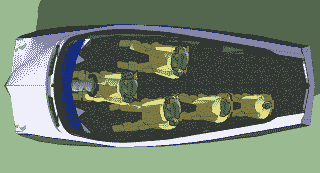
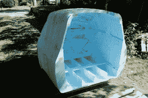

# 开源电动汽车卡宾不产生碳

> 原文：<https://hackaday.com/2014/06/11/open-source-electric-car-carben-produces-no-carbon/>

如果你设计并制造了一辆全尺寸汽车，请举手。没人吗？考虑到汽车制造商有数千人参与设计和制造汽车模型，这样做将是一项艰巨的任务。渴望海狸[尼尔]已经站出来，并采取了这一挑战。他已经开始了一个开源项目，他称之为[卡宾](http://neilblanchard.blogspot.com/2010/09/carbn-concept-ev-open-source-project.html)。

该计划是为汽车举行 5 人舒适，而只是比接穗 xA 大一点点。车身由泡沫制成，并将覆盖玻璃纤维。这款车的设计形状是朝着车尾逐渐变细，具有光滑的底面和带盖的车轮等特点，以创造低阻力系数。这款车的目标是每次充电行驶 300-400 英里，相当于每加仑行驶 224 英里。

到目前为止，身体是唯一完整的部分，但这本身仍然是一个相当重要的成就。[Neil]在草图上设计车身，然后将模型分割成薄片。他用数控切割机从泡沫片上切割出每一片。然后将这些切片粘在一起，暴露的边缘用砂纸打磨成光滑的形状。这个过程在【尼尔的】[网站](http://neilblanchard.blogspot.com/2013/04/carben-ev5-construction.html)上记录得非常好。

看起来这个项目有点停滞不前，或者[Neil]最近没有更新这个项目的文档。无论如何，我们认为这是一个伟大的项目，并期待看到它的进展。

[https://www.youtube.com/embed/A49N2onsN64?version=3&rel=1&showsearch=0&showinfo=1&iv_load_policy=1&fs=1&hl=en-US&autohide=2&wmode=transparent](https://www.youtube.com/embed/A49N2onsN64?version=3&rel=1&showsearch=0&showinfo=1&iv_load_policy=1&fs=1&hl=en-US&autohide=2&wmode=transparent)