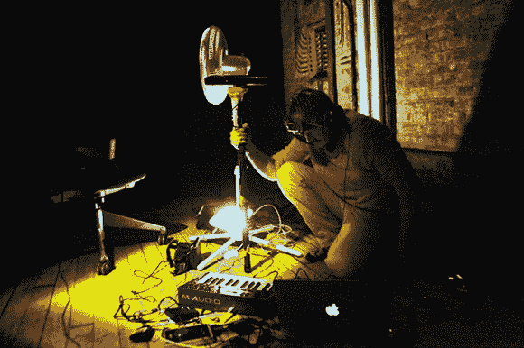

# 狂喜的计算:用虚拟现实探索技术萨满教

> 原文：<https://hackaday.com/2014/06/12/ecstatic-computation-exploring-technoshamanism-with-virtual-reality/>

这是 Oculus Rift 的一个非常聪明的用途——[狂喜计算](http://michaelpallison.com/projects/ecstaticcomputation/)，一个虚拟现实精神之旅。

[迈克尔·艾利森]开始了他的大学生涯，成为一名艺术家和音乐家……不知何故，最终成为了一名技术萨满。他在 2014 年 ITP 上提交的论文是关于计算艺术、虚拟现实、认知心理学以及他对各种宗教、精神和科学方法的研究，这些方法试图解释我们的身体、思想和宇宙本身之间的关系。

> 使用虚拟现实，入迷的计算是一种仪式，探索意识和量子能量在计算机内存的物理化学状态注册中的融合。人和电脑合二为一的时刻；思想变成比特，电子变成思想的那一刻。

听起来很疯狂？也许吧——但是休息之后看看视频演示。为了创造这种体验，他使用了 Oculus Rift、微软 Kinect、风扇、小键盘，当然还有电脑来渲染这一切。在参与者的旅程中，[迈克尔]带领他们飞行，穿过一个量子隧道，与计算机内存中状态注册内的量子能量融合，最终以坠入无穷大结束。

所有的图形和效果都是由 GLSL 一代使用他自己编写的名为 Smolder 的健壮图形渲染来动态生成的，该图形是在 [Cinder](http://libcinder.org/about/) 之上构建的。

[https://player.vimeo.com/video/94023435](https://player.vimeo.com/video/94023435)

以及[迈克尔]本人对这个项目和他的论文的深入解释:

[https://player.vimeo.com/video/96946848](https://player.vimeo.com/video/96946848)