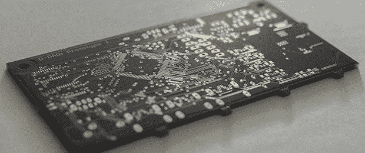

# THP 参赛作品:一切汽车的数字仪表

> 原文：<https://hackaday.com/2014/06/16/thp-entry-digital-gauges-for-everything-automotive/>

早在 2007 年，有人在大众 TDI 论坛上提出了一个新的增压计项目。在当时，这是一个了不起的工程壮举，能够在仪表板上的一个小有机发光二极管上显示歧管压力。自那以后，还没有任何项目达到这一水平。[Digital Corpus]正在重新审视这个项目，使它成为自己的项目，增加一些升级，[并将其纳入 Hackaday 奖](http://hackaday.io/project/964-D-DAQ)。

D-DAQ，正如[Digital]所称，他的新项目使用绝对压力传感器，不像它的前身。这使得涡轮计的量程比原来的项目大得多，也允许 D-DAQ 测量非柴油涡轮的部分真空。

此外，D-DAQ 比原来的项目具有更广泛的范围，因此其功能将远远超过一个简单的升压表。[Digital]将 D-DAQ 视为一个完整的性能监视器和记录器，能够跟踪废气温度、电池电压和 10 个模拟引脚的任何其他数据。数据将被保存到一个 MicroSD 卡上，D-DAQ 将不再只有一个显示屏，而是有三个 160×128 的 OLEDs。

这肯定不是你所期望的 Hackaday 奖项，但凭借这些功能，D-DAQ 很有可能成为一款成功的产品

* * *

 **本帖介绍的项目是[黑客大奖](http://hackaday.io/prize)中的一个参赛项目。建造一些令人敬畏的东西，赢得太空之旅或数百个其他奖品。**