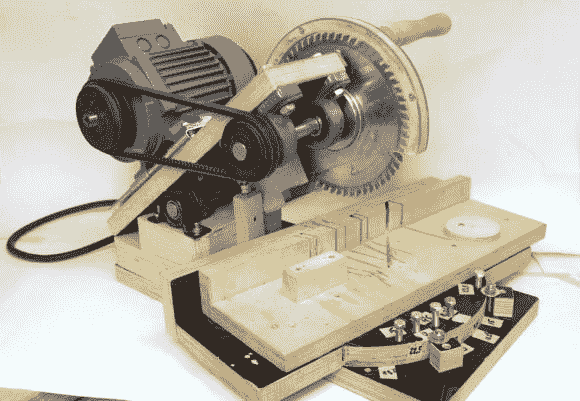

# 自制的斜切锯并不完全危险

> 原文：<https://hackaday.com/2014/06/14/home-made-miter-saw-is-not-completely-dangerous/>

如果“自制斜切锯”这个词立刻让你脑海中浮现出可怕的断肢画面，你并不孤单。快速的互联网搜索会产生一些非常做作的工具构建，我们甚至在 hackaday 上展示了一些。这把锯子是不同的。[Pekka]制造了一个非常酷的锯,用于在木头上切割非常精确的角度。

这种锯子是专门为一个目标而制造的:切割木材，这些木材将被粘合在一起用于分段车削。分段车削是对由许多不同类型的木材组成的木材进行整形。这产生了视觉上非常有趣的产品。

大多数锯子是由胶合板制成的。心轴的铰链和支撑是结实的现成轴台。带速度控制的三相电机通过皮带向心轴传输动力。通过沿电机安装底座进一步向后滑动电机来调节皮带张力。[Pekka]小心翼翼，使整个旋转组件几乎平衡，增加了易用性。典型的斜切锯旋转锯片以获得不同的切割角度。这种设计旋转锯栅栏。

为了安全起见，手柄上有一对聚碳酸酯锯片护板和一个微型开关，除非按下，否则不会让锯子启动。微动开关还有一个辅助功能，当松开时，它会对电机施加电子制动，以便旋转的刀片在向上提起刀片时不会接触到工件。