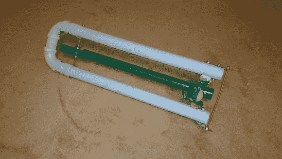

# 网球发射器有小狗跑 100 米短跑

> 原文：<https://hackaday.com/2014/06/14/tennis-ball-launcher-has-puppies-running-the-100m-dash/>

[Brian]来自 24 小时的工程师有一个患有关节炎的朋友，他不能轻松地与他的新小狗一起打球——所以[Brian]介入并为他制作了这个令人敬畏的网球发射器。

你看，大多数网球发射器需要手腕的有力摆动，因为只是简单的老式投掷也是不可能的，[布莱恩]必须让他变得强大和易于使用。在画出一些设计草图后，他想出了最终成为上图的基本概念。

框架由 2”PVC 管制成，有两个目的，支撑和安全。弹力绳发射系统实际上包含在管道中，使其不碍事，并且在发射过程中不会挂住任何东西。安装在绳索开口处的一对滑轮确保绳索不会磨损。

我们真正喜欢的是由一些精心切割的木头制成的触发机制，一个钢制角撑和一些螺母和螺栓。这是一个简单的机制，提供了杠杆作用和一个简单的方法来释放橡皮筋。

现在我们知道你们都在想什么——一个有关节炎的人应该如何装载这个东西？嗯，它实际上是脚加载的:站直它，把你的脚放在球带上，然后向下踩，直到它卡入触发机制。这就像把十字弓倒着装…出于显而易见的原因，你永远不会这么做。尽管如此，我们认为与削尖的钢螺栓相比，网球的风险相对较低…

如果你想建造你自己的，布莱恩在他的网站上列出了你需要知道的一切，并计划在某个时候将它变成一个指导——通过他的建造日志甚至还有更多**信息**[。](http://24hourengineer.blogspot.ca/search?q=%22Tennis+Ball+Launcher%22&max-results=20&by-date=true)

如果你觉得特别懒，你也可以[造一辆电动版](http://hackaday.com/2012/07/30/dino-builds-a-fetch-o-matic-for-this-months-make/)。