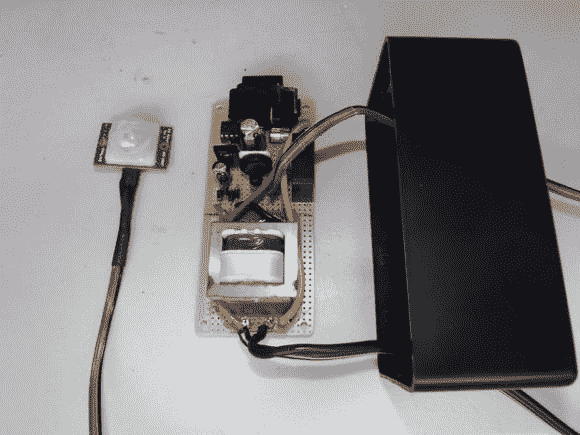

# 一种主要使用分立元件的运动激活交流开关电路

> 原文：<https://hackaday.com/2014/06/15/a-motion-activated-ac-switching-circuit-using-mostly-discreet-components/>

如果你曾经和一棵灯火通明的圣诞树打过交道，你可能会理解不得不爬到树下开灯关灯的挫败感。感受你的痛苦。他发明了自己的动作激活交流开关电路来自动开关灯。运动传感器确保只有当周围有人真正看到灯的时候灯才会亮。该电路还有一个可调计时器，因此[brmarcum]可以改变灯亮的时间长度。

这个项目被分成几个不同的部分。这使得电路的构建和调试更加容易。主电源首先通过变压器将电压降低 10 倍。剩下的被过滤并调节到 9VDC。[brmarcum]使用的视差 PIR 传感器需要 4.5V 电压。因此，使用分压器电路再次降低 9V 信号。

当 PIR 传感器被触发时，它会激活计时器电路。定时器电路由 555 定时器驱动。该电路本身最初是从一本经典的[福里斯特·米姆斯](https://www.google.com/url?sa=t&rct=j&q=&esrc=s&source=web&cd=1&cad=rja&uact=8&ved=0CCwQFjAA&url=http%3A%2F%2Fen.wikipedia.org%2Fwiki%2FForrest_Mims&ei=j6WcU9vqFIi6oQTS7IHwDw&usg=AFQjCNETd_6fKt_xfn_-nGlFxGBCS-JkDQ&bvm=bv.68911936,d.cGU "Forrest Mims")书中借来的，尽管它被稍微修改以适应 PIR 传感器。原来的按钮触发器被移除，并替换为来自 PIR 传感器的信号。唯一的问题是，电路预期低信号作为触发器，而 PIR 传感器输出高信号。[brmarcum]使用 NPN BJT 反转信号解决了这个问题。一旦定时器被触发，它就会启动一个继电器，让市电流向电灯。

将整个电路焊接到一块原型板上。然后将最终产品安全地安装在绝缘塑料盒内。这使得他可以将电路安全地安装在圣诞树裙下。PIR 传感器位于外壳外部，并连接到采油树本身。这使得传感器仍然可以检测房间内的运动，而电路的其余部分则被隐藏起来。

[via [Reddit](http://www.reddit.com/r/electronics/comments/283yxj/just_finished_a_motion_activated_ac_switch_no/ "reddit.com")