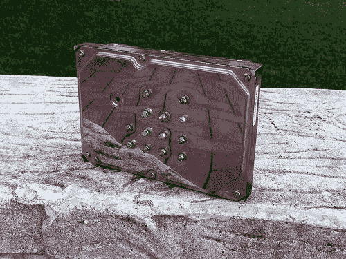

# 硬盘时钟简洁大方

> 原文：<https://hackaday.com/2014/06/14/hard-drive-clock-is-simple-and-elegant/>

[Aaron]一直想建造自己的二进制座钟已经有一段时间了。这是他的第一个时钟项目，所以他决定保持简单，让它简单地显示时间。没有警报，钟声，或哨声。

电子设备相对简单。[Aaron]决定使用他放在周围的 ATMega328 芯片中的一个，该芯片已经烧录了 Arduino 引导加载程序。他首先在试验板上构建了自己的 Arduino 板，然后作为一种更持久的解决方案，在一块 protoboard 上重新构建了它。Arduino 从实时时钟(RTC)模块获取时间，然后使用蓝色和绿色 LED 阵列显示时间。整个装置由一个备用的 9V 壁式麦芽汁电源供电。

[Aaron]选择使用 DS1307 RTC 模块来计时。这将确保时间在一段时间内保持准确。RTC 模块有自己的内置电池，这意味着如果[Aaron 的]时钟断电，它仍会记住时间。RTC 电池理论上可以使用长达十年。

[Aaron]他的时钟外壳很有创意，升级了一个旧硬盘。所有的硬盘都被移除，换上了他自己的电子设备。前盖钻了 13 个孔，供 led 使用。有六个绿色 LED 显示小时，七个蓝色 LED 显示分钟。发光二极管被连接成公共阴极。由于硬盘盖是导电的，[Aaron]用绝缘胶带和热熔胶覆盖了电路板的两面，以防止任何短路。最终的结果是一个优雅的二进制时钟，任何极客都会感到自豪。