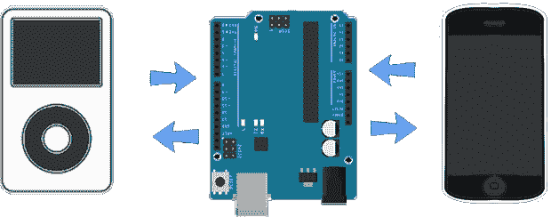

# Android 蓝牙 IPod 控制器

> 原文：<https://hackaday.com/2014/06/16/the-bluetooth-ipod-controller-for-android/>

到目前为止，在工业化世界中，几乎每个人都有一个屏幕破裂的破 iPod，一个无法充电的电池，或者一个简单地放在抽屉里的 iPod。不过，iPod 仍然是存储音乐的一个很好的方式，而且[特雷弗]想出了一个用 Android 设备控制其播放的方法，用一个 Arduino 和一个便宜的蓝牙适配器显示歌曲名称、播放列表和其他一切

通过 30 针基座连接器上特定针的正确电阻，iPods 将通过串行连接发送曲目名称和播放列表，并响应播放、暂停、跳过和音量命令。在小型微控制器项目中实现这种 iPod 附件模式的大量文档还没有多少工作，但是经过一点点努力，[Trevor]成功地用 Arduino 复制了常见的 iPod dock 命令。

使用 HC-05 蓝牙模块，可以让这个与 iPod 连接的 Arduino 通过一个小应用程序与 Android 设备[来回中继数据。电路很简单，应用程序是免费的，如果你有一个旧电池或破裂屏幕的 iPod，它仍然可以作为音乐存储设备。还不错，[特雷弗]。](https://play.google.com/store/apps/details?id=com.erroneousdata.musehacklite)