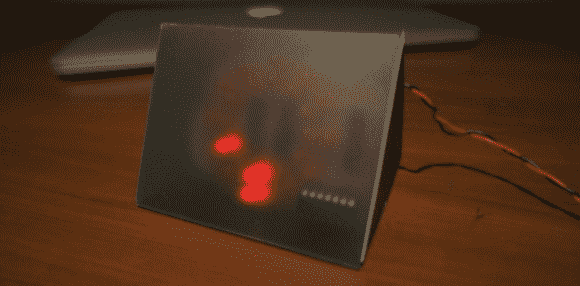
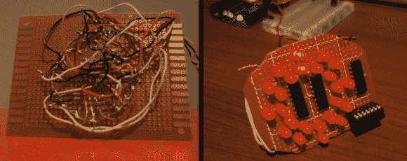

# ATtiny84 供电极简 LED 时钟

> 原文：<https://hackaday.com/2014/06/16/attiny84-powered-minimalist-led-clock/>

我们有很多基于 HaD 的时钟构建，原因是它们很酷。即使是简单的也很酷。不是每个人都能说他们造了一个钟。[Chris]乘坐 DIY 时钟列车，发明了这个由 ATtiny84 芯片控制的 [LED 时钟](http://chris.gunawardena.id.au/software-development/building-a-clock-based-on-arduino/)。

该时钟共有 24 个发光二极管，每小时一个，每 5 分钟一个。24 个发光二极管排列成两个同心环。为了显示小时，同一角度的两个发光二极管都被点亮。为了显示分钟，只有内部的 LED 亮起。上面的主图显示的是 6:40。

如果你熟悉 ATtiny84，你会知道它只有 12 个输入/输出引脚，远远少于需要控制的 led 数量。[Chris]决定使用一些 74HC595 移位寄存器来增加 ATtiny 上的 IO 引脚。整个建筑安装在一个原型板上，有相当多的点对点布线。一个简单的有色塑料盒完成了这个项目，并给它一个现代的外观。

[克里斯]提供了他的时钟的代码，以防任何读者有兴趣制作一个。

