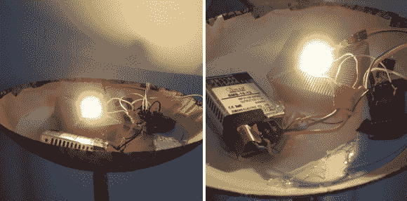

# 从 300 瓦到 10 瓦——LED 照明解决方案

> 原文：<https://hackaday.com/2014/06/16/from-300w-to-10w-a-led-lighting-solution/>

卤素灯很棒——它们产生很多明亮温暖的光，但是它们需要消耗很多能量。[Sven]几年前发现了一个很好的落地灯，形状相当粗糙——他的妻子重新装修了它，他修好了它，但是在 300 瓦的功耗和缺乏调光电路之间(这东西很亮！)，他知道[他必须升级。](http://perso.aquilenet.fr/~sven337/english/2014/05/08/Transforming-halogen-lamp-into-LED-lamp.html)

就像我们对所有项目的建议一样，[斯文]从为转化设定一些目标开始。他希望保持暖色调，产生超过 700 流明，允许通过远程调光，并与存在检测一起工作。

他采购了需要 12V @950mA 才能运行的 10W 功率 LED，这几乎难倒了他，因为事实证明这种规格的 LED 驱动器并不多见！幸运的是，他设法从中国找到了一个不太大的，可以和其他部件一起放在灯罩里的。他为 LED 找到了一个大型散热器，为了安全起见，他甚至在 Arduino 上安装了一个温度传感器，以便在温度过高时关闭它。Arduino 还提供调光电路和遥控功能。

[Sven]承认最终结果并不漂亮，但对他来说很幸运，它大约有 6 英尺高，所以没有人能看到里面杂乱的电线和组件！这也只是第一次迭代，因为他计划进一步升级它——事实证明，700lm 是不够的。