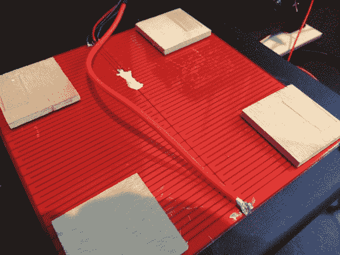

# 加热印刷机器人的床

> 原文：<https://hackaday.com/2014/06/16/heating-up-a-printrbots-bed/>

3D 打印机的加热床有助于减少零件的卷曲和翘曲。当零件冷却和收缩时，就会发生翘曲。加热床可在整个印刷过程中保持零件温暖，并减少翘曲。

作为对她的 Printrbot 的升级，[Erin] [增加了一个加热床](http://www.integerlabs.net/blog/2014/6/13/9z1ne6hrqluhy3flw5f987jitd6g9b)。第一个计划是用镍铬合金线 DIY 一个，但加热床价格低廉。它们基本上只是一个带有长走线的 PCB，充当电阻。她增加了一个热敏电阻来监测温度，并允许精确控制。

Printrbot 加热床工作正常，但加热速度不够快。[Erin]迅速刮掉阻焊膜，将新引线焊接到电路板上。这将电路板转换成两个并联电阻，电阻减半，功率加倍。

这个版本升温很快，但是没有稳定的热度。使用简单的控制是不够的，需要一个 PID 控制器。这种类型的控制回路有助于处理振荡等问题。

Printrbot 的固件基于 [Marlin](http://reprap.org/wiki/Marlin) ，默认情况下禁用 PID 支持。重建代码并刷新后，可以使用 g 代码调整 PID 增益。随着这些值的调整，[Erin]的打印机保持稳定的热量，现在可以打印 ABS 和 PLA，翘曲最小。