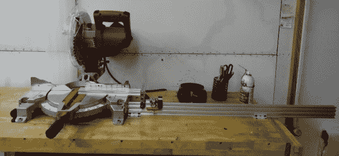
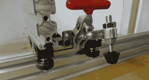

# 斜切锯停止节省时间和恶化

> 原文：<https://hackaday.com/2014/06/19/miter-saw-stop-saves-time-and-aggravation/>

斜切锯是从各种角度切割木头的好工具。如果你曾经在斜切锯上切过很长的一块，毫无疑问，你要么把延长的一端支撑在一堆废木头上，要么请人拿着悬着的那块，这样你就可以得到准确的切割。做任何一件事都有点做作，而且让人头疼。

[Kram242]启动了一个可以消除这些问题的项目，并提供了一个解决多个工件的一致长度切割的方案。这是一个[可调停止](http://www.openbuilds.com/builds/v-slot-miter-saw-stop.549/)肯定会使斜切锯削减少得多讨厌。

该钻机非常简单，由一块铝挤压件、v 型轮支架和杠杆驱动夹具组成。可移动的托架使操作员能够快速定位挡块，以确保木材在合适的位置被切割。这种停止方式也便于将几块木头切割成完全相同的长度。

如果我们必须提出任何改进建议，那就是给托架增加支撑，模仿锯床和止挡以及[胶带](http://www.staples.com/Handy-Tape-Self-Adhesive-Measuring-Tape-25-Feet/product_291927)导轨。

