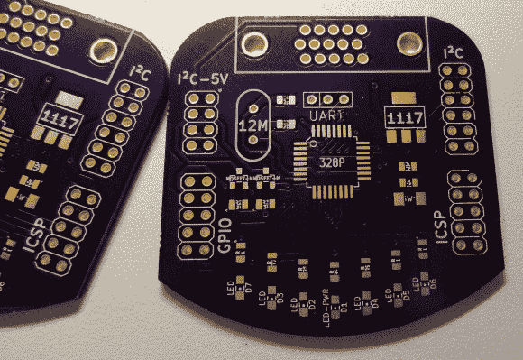

# I2C 从你的 VGA 端口

> 原文：<https://hackaday.com/2014/06/18/i2c-from-your-vga-port/>

VGA、DVI 和 HDMI 端口使用显示数据通道(DDC)与连接的显示器通信。这使得显示器可以即插即用。然而，DDC 是基于 I2C 的，它被用于各种电子产品中。为了在几乎每台计算机上利用这个 I2C 端口，[Josef]建立了一个 [VGA 到 I2C 的分线点](http://blog.atx.name/twilight-vga-i2c-breakout-board/)。

这个突破是基于一篇关于[制造一个 0.25 美元的 I2C 适配器](http://www.paintyourdragon.com/?p=43)的旧文章。这个适配器从视频端口劫持特定的线路，并使内核相信它是一个标准的 I2C 设备。一旦完成，诸如 [i2c-tools](http://www.lm-sensors.org/wiki/I2CTools) 之类的应用程序就可以用来与端口进行交互。

[约瑟夫]决定在这个项目上大开杀戒。通过在板上放置 ATmega328，可以增加对 GPIOs 和 led 的控制。增加了 I2C 的电平转换器，因此它可以用于较低电压的设备。最终产品是一个 I2C 适配器、GPIOs 和 led，可以通过一个未使用的视频端口从 Linux 内核直接控制它们。