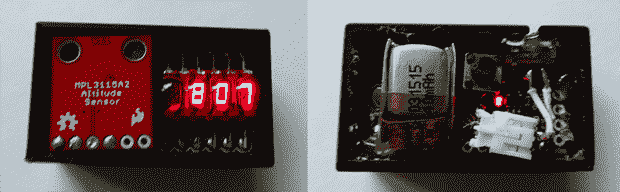

# 终极微型高度计

> 原文：<https://hackaday.com/2014/06/20/the-ultimate-tiny-altimeter/>

虽然传统上一个项目更适合模型火箭人群，但现在很多人都在驾驶四轴飞行器，知道你的遥控飞机达到的高度是一件很好的事情。[威尔]想出了一个非常好、非常小、非常轻的高度计,非常适合绑在微型飞行器上，它们的大兄弟，当然还有模型火箭。作为一个不错的奖励，它看起来也非常酷，有一个非常复古的惠普气泡显示器。

这个微型高度计中使用的组件包括一个 MEMS 高度和压力传感器，具有四个七段 led 的惠普气泡显示器，一个 Arduino Pro Mini 和一个能够为整个装置供电几个小时的微型 40 mAh LiPo。

在下面的视频中，[威尔]展示了他的高度计的功能，通过四轴飞行器将其发送到大约 100 英尺的高空。有显示最小、最大和 delta 高度的设置，所有这些都可以通过一个按钮来访问。

虽然它不是最具特色的高度计，但它仍然比模型火箭人群可用的商业产品好得多。

[https://www.youtube.com/embed/exJxaE8vpMk?version=3&rel=1&showsearch=0&showinfo=1&iv_load_policy=1&fs=1&hl=en-US&autohide=2&wmode=transparent](https://www.youtube.com/embed/exJxaE8vpMk?version=3&rel=1&showsearch=0&showinfo=1&iv_load_policy=1&fs=1&hl=en-US&autohide=2&wmode=transparent)