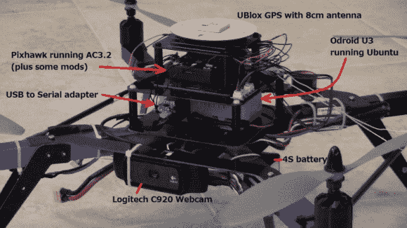

# 自主气球爆破

> 原文：<https://hackaday.com/2014/06/20/autonomous-balloon-popping/>

在接受自动驾驶汽车的挑战时，[兰迪]组装了这架可以定位和弹出气球的[无人机](http://diydrones.com/profiles/blogs/red-balloon-finder)。它是为今年的 [Sparkfun 自动驾驶汽车比赛](https://avc.sparkfun.com/)组装的，该比赛将挑战参赛者在无人干预的情况下定位并弹出 [~~99 个 luftbaloons~~](https://www.youtube.com/watch?v=Lur-SGl3uw8) 红色气球。

这个机器人的主控制器是 [Pixhawk](http://store.3drobotics.com/products/3dr-pixhawk) ，它运行 [ArduCopter](http://copter.ardupilot.com/) 固件的[修改版](https://github.com/rmackay9/rmackay9-ardupilot/tree/avc3)。这些修改使 Pixhawk 能够接收来自 [Odroid U3](http://www.hardkernel.com/main/products/prdt_info.php?g_code=G138733896281) 计算机模块的命令。Odroid 使用网络摄像头拍摄图像，然后使用 OpenCV 进行处理。它试图找到大的红色物体并飞向它们。

Odroid 上的视觉处理和控制代码是使用 [MAVProxy](http://tridge.github.io/MAVProxy/) 和 [Drone API](http://dev.ardupilot.com/wiki/droneapi-tutorial/) 开发的。这允许使用 Python 开发所有的定制代码。

Sparkfun AVC 将于明天——6 月 21 日在科罗拉多州的博尔德举行。你仍然可以免费注册观看。我们希望[兰迪]的无人机能够胜任这项任务，根据休息后的视频，它应该能够完成这项挑战。

[https://www.youtube.com/embed/yRmXwRqPesY?version=3&rel=1&showsearch=0&showinfo=1&iv_load_policy=1&fs=1&hl=en-US&autohide=2&wmode=transparent](https://www.youtube.com/embed/yRmXwRqPesY?version=3&rel=1&showsearch=0&showinfo=1&iv_load_policy=1&fs=1&hl=en-US&autohide=2&wmode=transparent)