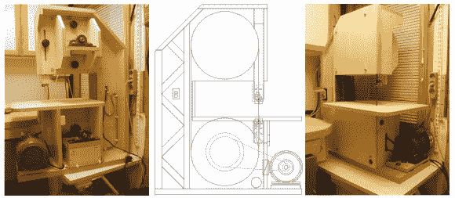

# 木制带锯害怕它的木工兄弟

> 原文：<https://hackaday.com/2014/06/22/wooden-band-saw-fears-its-wood-cutting-brethren/>

比用木头做一个[带锯更酷的是什么？当然是二号楼！这正是[佩卡]所做的。第一个是小型台式模型，而第二个是一个大得多的版本，锯条串在 13-3/4 英寸的大轮子之间。对于那些不熟悉带锯的人来说，它们是一种工具，有一个细长的刀片，围绕着旋转的轮子。轮子分开，使刀片绷紧。与竖锯、全锯或线锯的往复运动不同，带锯条不断地朝一个方向旋转。这些刀片通常很薄，很容易切割不规则和弯曲的形状。](http://woodgears.ca/reader/pekka/bandsaw.html)

[Pekka 的]大型机器的框架由 35 毫米(~1-3/8 英寸)胶合板制成。这被证明是一种坚固的框架材料。前面提到的轮子是通过将橡木片粘合在一起，将组件安装在木材车床上，然后将外径缩小到所需尺寸而制成的。通过使用多块木头来构造轮子，允许每个部分的纹理方向与刀片平行。这种构造方法确保木材在车轮周围的任何膨胀/收缩都是均匀的。刀片外径周围的橡胶条提供了防止刀片滑动所需的摩擦力。

[佩卡的]朋友很好，在他的金属车床上转动了带凸缘的车轴。这些轴支撑木制车轮，并安装在轴台轴承中。上部轴台安装在一个滑动支架上，可以调节锯片的张力。[Pekka]不会满足于一个单速带锯，所以他拿起一个他一直在踢来踢去的电机，它最初来自一个木材车床，已经有 4 个不同大小的滑轮安装在轴上。

这是一个伟大的项目，它展示了用一点点渴望和聪明才智可以完成的事情。