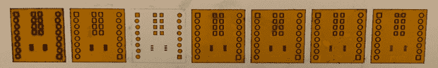

# 一次性 Kapton 阻焊膜

> 原文：<https://hackaday.com/2014/06/22/one-off-kapton-solder-masks/>

随着台式路由器的激增，以及许多在家里制作 PCB 的简单方法，没有理由再有人需要购买预制的分线板了。然而，传统技术只能给你一个铜层，如果你想要一个更耐用的 PCB，你必须想出一些办法在自制的 PCB 上制作一个阻焊层。[Chris]认为 Kapton 胶带可以做一个合理的阻焊膜，并在项目现场记录了用激光切割机[制作阻焊膜的过程。](http://hackaday.io/project/1554-Making-a-solder-mask-using-Kapton-tape)

阻焊膜本身是从一片 Kapton 胶带上切割下来的，这种东西应该可以在任何库存充足的修补工具箱中找到。[Chris]激光切割机的软件是一个通用激光系统模型，已经有了聚酯薄膜的设置，这对于 Kapton 磁带来说很方便，

当然，获得激光切割的正确形状和尺寸需要在 Eagle 和 Corel Draw 中做一些手脚。激光应该切割的区域取自 Eagle 中的 tCream 和 tStop 层，从焊盘边缘向后拉 1 密耳。这已导出到。EPS 文件，在 Corel Draw 中打开，并转换为激光切割机的艺术线条图。

结果是一个快速和容易的阻焊膜，应该非常耐用。虽然它可能不如真正的 PCB 中使用的紫外线固化涂料耐用，但在制作真正的电路板之前，Kapton 对于一些原型来说已经足够了。