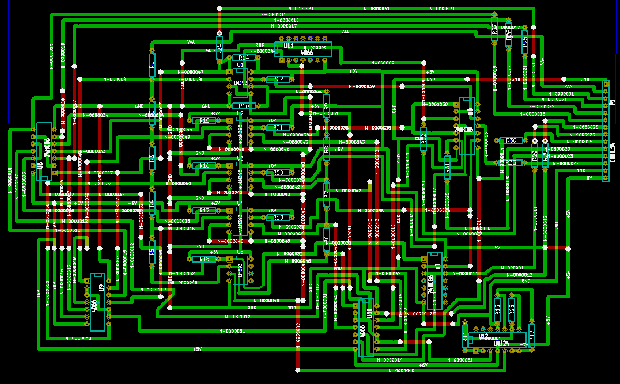

# 基于状态的谢妮万用表

> 原文：<https://hackaday.com/2014/06/24/the-state-based-nixie-multimeter/>

IN-15A 数码管有符号，特别是 n，μ，P，-，+，M，M，k，π和%。相关的 IN-15B 谢妮有字母:A、F、H、Hz、ω、S、V 和 w。这些字母您应该很熟悉。[kittan]决定拥有一台配备谢妮的万用表将会非常酷，既然他无论如何都要回归神话，他也可以让他的万用表没有控制器，具有分立逻辑和比较器 ic。这是一个基于州的谢妮万用表，它将会非常棒。

[万用表的基本方案](http://hackaday.io/project/1458/log/3592-input-and-decade-ladder-schematic)是一个精密的 1V 电压基准、一串运算放大器和一吨电阻组成一个梯形。每个十进制中的所有运算放大器一起进行异或运算，因此当每个十进制级的十个比较器中的一个被触发时，只有一个数字会显示在(数字)数码管上。

有了测量电压的合理计划，[扩展设计用于其他测量](http://hackaday.io/project/1458/log/3771-additional-function-extensions)并不困难。V=IR，因此在恒定电流下，V=R。同样的等式可以用于固定电阻来确定电流。电容可以通过比较已知电容器的电荷变化来测量。电感、电导、功率和频率都是为万用表这个庞然大物设计的。

[初始 PCB 设计](http://hackaday.io/project/1458/log/3955-initial-ladderboard-pcb-design)已经完成(如上所示),理论上可以用最少的跳线在单面板上完成。这是一个令人惊叹的项目，尽管你可能会在垃圾堆或收藏家的架子上找到类似的古老仪表，但这是迄今为止我们见过的最好的谢妮项目之一。