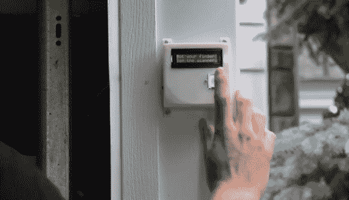

# 指纹扫描仪既简化了打开车库门的过程，也使之变得复杂

> 原文：<https://hackaday.com/2014/06/25/fingerprint-scanner-both-simplifies-and-complicates-opening-garage-door/>

用手打开车库门既费事又麻烦，因此出现了车库门开启器。现在，有些人甚至会说按遥控器的按钮太费力了。[nodcah]就是其中之一，所以他发明了一个[指纹扫描仪](http://www.instructables.com/id/DIY-Fingerprint-Scanning-Garage-Door-Opener/?ALLSTEPS)来控制预装的车库门开启器。玩笑归玩笑，这是一个很酷的项目，它让你进入你的车库，把陌生人挡在外面，而且不需要你记得带钥匙或遥控器。

这个项目的中心是一个运行自定义 Arduino 代码的 ATmega328。该 ATmega328 负责控制 16 字符、2 行 LCD 屏幕，并与 Sparkfun 的现成指纹扫描仪通信。指纹扫描仪有一个内置的 CPU，可以存储多达 20 个指纹，并做所有自己的指纹扫描处理。然后，它通过串行 Tx 和 Rx 线路用简单的命令与 ATmega328 通信。

ATmega328、LCD 和指纹扫描仪都安装在车库外面的 3D 打印外壳中。如果内部车库打开/关闭按钮的电线直接进入这个室外模块，任何人都可以打开它，短接电线并进入车库。为了防止这种情况，如果 ATmega328 从指纹扫描仪获得“OK ”,它就会向车库内的 ATtiny85 发送信号。如果 ATtiny85 接收到正确的信号，它将通过短路打开/关闭按钮触点来启动车库门开启器。这可以防止任何人溜进车库。

[nodcah]通过提供所有的零件列表、原理图、说明和 Arduino 代码，为社区做出了巨大的贡献，因此任何人都可以轻松地将这个项目组合在一起。

[https://www.youtube.com/embed/uK8gm9a0k-g?version=3&rel=1&showsearch=0&showinfo=1&iv_load_policy=1&fs=1&hl=en-US&autohide=2&wmode=transparent](https://www.youtube.com/embed/uK8gm9a0k-g?version=3&rel=1&showsearch=0&showinfo=1&iv_load_policy=1&fs=1&hl=en-US&autohide=2&wmode=transparent)

[ [经由 adafruit.com](http://www.adafruit.com/blog/2014/06/23/diy-fingerprint-scanning-garage-door-opener/)