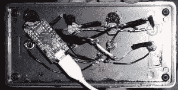

# 吉他钻机 5 的 DIY 脚踏板控制器

> 原文：<https://hackaday.com/2014/06/25/diy-foot-pedal-controller-for-guitar-rig-5/>

在过去，需要外部吉他效果踏板来修改吉他的声音。随着计算机处理能力以指数速度增长，基于软件的效果建模器变得越来越普遍。[Matthew]的爸爸正在他的联想平板电脑上运行吉他钻机 5 建模软件。虽然效果很好，但是边玩边换效果和功放型号很麻烦。这就是[马修]出现的原因。他制造了一个[脚踏控制器](https://sites.google.com/site/mtthacks/)，这样他的父亲就可以在飞行中改变那些甜美的声音。

吉他钻机 5 有能力改变按键预置。即便如此，无论是在实体上还是在屏幕上，弹奏时敲击键盘仍然是一件麻烦的事情。由于带有 ATMEGA32U4 芯片的 Arduino 兼容板可以用来模拟 HID 设备，[Matthew]决定使用一个作为他项目的基础。安装在投影盒中的标准按钮指示微控制器将哪些键盘命令发送到平板电脑。在这个版本中有 4 个按钮用于 4 个预设，但是可以使用任何数量。当按钮被按下时，相关的键盘命令通过 USB 电缆被发送到平板电脑，吉他装置 5 通过改变预置来响应该命令。为了让您知道自己的位置，每个按钮旁边的指示灯会显示当前的预设。

如果这是你有兴趣为自己构建的东西，[Matthew]在上面的链接中提供了 Arduino 代码。

[https://www.youtube.com/embed/_Nb_sxrfVgQ?version=3&rel=1&showsearch=0&showinfo=1&iv_load_policy=1&fs=1&hl=en-US&autohide=2&wmode=transparent](https://www.youtube.com/embed/_Nb_sxrfVgQ?version=3&rel=1&showsearch=0&showinfo=1&iv_load_policy=1&fs=1&hl=en-US&autohide=2&wmode=transparent)